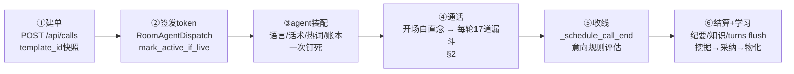
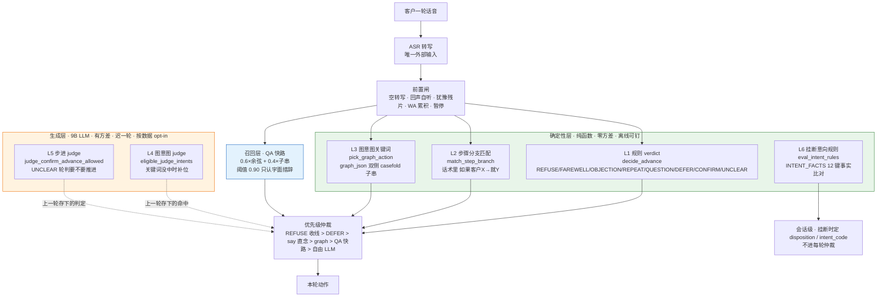
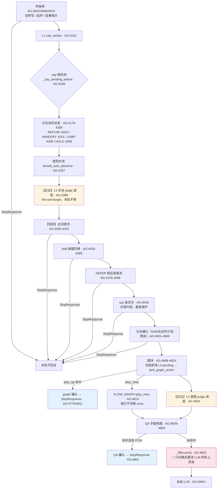
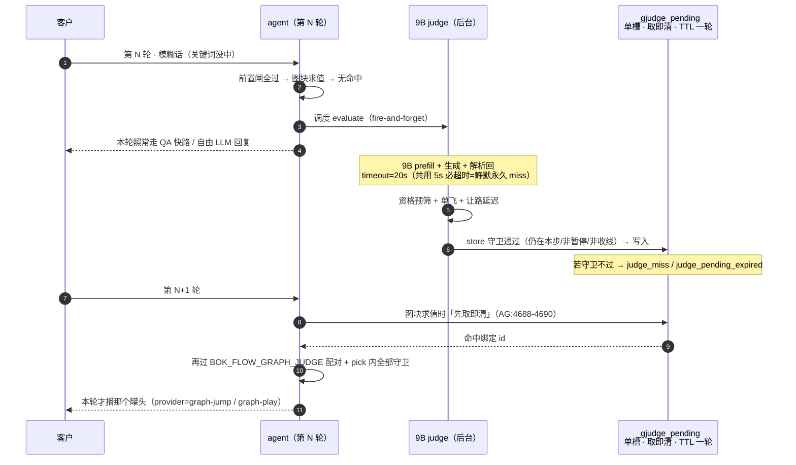
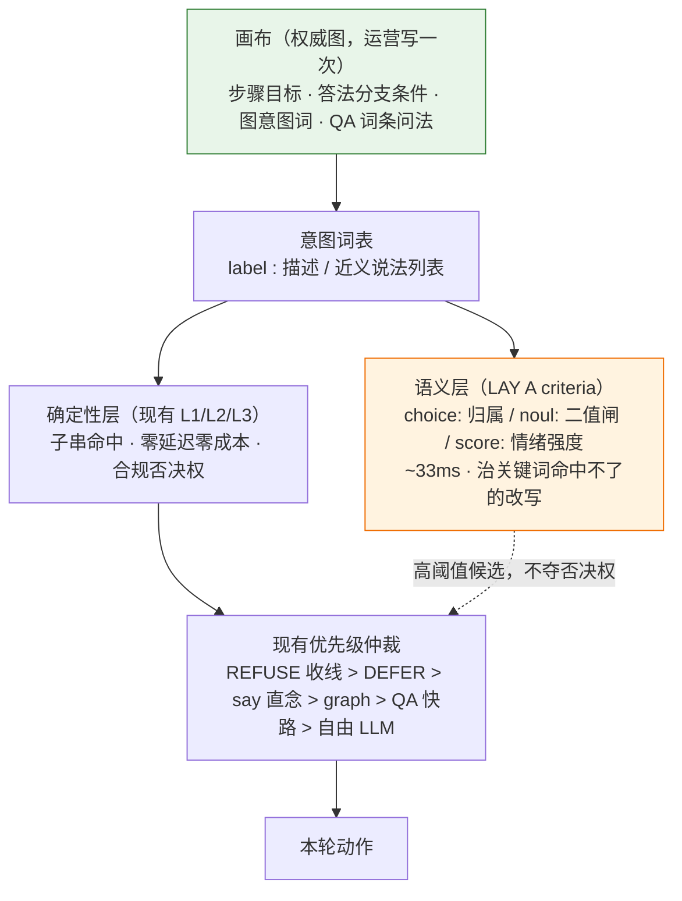

# A 线完整工作逻辑（代码级追踪版）

> 2026-09-20。本文不是 AGENTS.md 军规复读，而是对 A 线源码的**逐行追踪综合**：四路并行深读
> （agent.py 5305 行 / flow.py 1701 行 / qa_gate.py 300 行 / fillers.py 853 行 /
> livekit_plugins.py 6187 行 / control_plane main.py / repository.py），全部结论带 `文件:行号`
> 证据。全局组件拓扑见 `bok-architecture.json`（archify），本文专注**运行逻辑**：什么节点做什么事、
> 意图识别怎么判别、数据在哪一列。
>
> **行号权威性**：§1–§9 的行号随代码演进已部分漂移（本轮实测差 +58 到 +498 行，§2 的 #14 一行
> 更是指向了隔壁的块）。若某处行号与 **§10.5「行号漂移校正表」** 不一致，**以 §10.5 为准**；
> 闸门的**顺序**在各节之间一致，需要重取坐标时只看 §10.5。
>
> 路径缩写：`AG`=apps/agent/agent_runtime/agent.py；`FL`=…/flow.py；`LKP`=…/providers/livekit_plugins.py；
> `QG`=…/qa_gate.py；`FD`=…/fillers.py；`CP`=apps/control-plane/control_plane/main.py；
> `RP`=packages/business-db/bok_voice_business_db/repository.py。
> 注：上一会话修复分支 `session-20260919-232858-4eb7`（max_step_reached/_judge_health 降级/
> session_report CAS 等 18 项）**尚未合并**，本文行号基于 origin/main@3385529 + 本会话 web 分支。

## 0. 全景：一通电话的六个阶段



| 进程 | 端口 | 在通话里的职责 |
|---|---|---|
| CP (FastAPI) | :8000 | 建单/token/turns 收账/wa/assist/dial-result/settle/模板发布两态 |
| LiveKit | :7880 | 房间信令；token 挂 `RoomAgentDispatch(agent_name="bok-voice")` 派 worker（CP:1452-1463） |
| agent worker | :8081 | 装配+每轮漏斗+收线+turns 上报（AG `entrypoint` 1727） |
| ASR sidecar | :8787 | PCM→文本：句级提交/join-hold/热词；会话 TTL 180s（sidecar app.py:174-201） |
| TTS | MiniMax 云 / :8788 | bidi 长连接+看门狗；`CachedTTS` 键=text+voice+model 精确 sha1（TC:66-84） |
| LLM 4B | :1235 | 实时回复；KV 严格前缀契约（LKP:1772-1915） |
| LLM 9B | :1237 | 后台岗：flow judge / 意图判据 / 结算纪要（缺盘回退 :1235） |

## 1. 装配阶段（AG:1727-2830，会话级钉死）

| 钉死项 | 实现 | 证据 |
|---|---|---|
| 话术来源 | call.template_id 快照 > 对象卡绑定；机器通道 GET 模板 → `_template_machine_overlay` **冻结 published_json 覆盖 live** | AG:1777-1783；CP:4110-4119、4077-4096 |
| 语言 | `PinnedLanguageState`+`set_user_language` 一次写入，整通不切换 | AG:1976-1985 |
| 流程引擎 | `FlowController.from_template`：steps_json（空则旧四段转步）+ object_vars（单号逐位转汉字）+ graph 宽容解析 | FL:902-909、233-249、252-288 |
| 热词 | 模板+行业+对象三层 ≤200 字，随 /api/start 下发 sidecar | AG:2269；LKP:5486-5495 |
| 对象档案 | `_wire_object_brief` ≤2 行静态进前缀 | AG:1790、1612-1630 |
| 意向规则 | `cp.list_intent_rules` 拉到 worker 内存（评估在 agent，CP 只存） | AG:2824-2830 |
| QA 索引 | 有 TTS 缓存且（快路开 或 图有 play_qa 绑定）才建 `QaIndex` | AG:2787-2820 |
| 钩子注册 | metrics/item_added×2/close/shutdown×2/心跳×2/partial 闸/spec busy/speech_created——**全部先于 session.start**（start 在 4683） | AG:3122-4677 |
| 开场白 | 第 1 步 ref 首行直念（变量缺失退通用语）；`_prefix_prewarm_task` 用 turn-1 同构形状与 TTS **并行**预热 | AG:4716-4748、2835-2869 |

## 2. 每轮意图漏斗（AG `on_user_turn_completed` :3500 起，**按代码实际执行顺序**）

前置：框架 turn commit（STT 句级 FINAL 路径，见 §4）→ 钩子。17 道闸，前者命中即短路：

| # | 闸门 | 证据 | 命中行为 | 推进 |
|---|---|---|---|---|
| 0 | 心跳归零/disarm/filler.cancel/看门狗武装 | AG:3511-3518 | — | — |
| 1 | 回声自听守卫：speaking 中+两边≥6字+相似≥0.9 | AG:3558-3567、1092-1112 | 整轮丢弃 | 否 |
| 2 | 热词词表回声守卫（剥尾保头） | AG:3578-3596 | 丢弃或改写文本 | 否 |
| 3 | 暂停冻结 | AG:3607-3620 | 落库 gen=paused | 冻结 |
| 4 | 打断风暴静听（resume/ack/silent） | AG:3629-3686、694-718 | ack=直念短承接 / listen=静默 | 否 |
| 5 | 饿死兜底（连续2轮零输出） | AG:3694-3726 | 直念 starve_ack | 否 |
| 6 | WA 收号碎片累积（<8位数字主导/自报头→stash+5s flush） | AG:3727-3777、2029-2085 | stash：不回复不推进 | 否 |
| 7 | 通用单号累积（非 WA 步） | AG:3783-3824、2093-2138 | 同上 | 否 |
| 8 | WhatsApp 信号检测（captured/captured_implicit/offered；already_captured 防确认轮锁死） | AG:3825-3864；FL:674-739 | 静默记账+上报 | 否 |
| 9 | 事实沉淀 extract_call_facts→尾部 | AG:3868-3872 | — | 否 |
| 10 | **规则 verdict**（顺序：REFUSE→FAREWELL→auto/CONFIRM→UNCLEAR/QUESTION） | AG:4084-4241；词表见 §3.1 | **REFUSE→closing+14s 收线；FAREWELL→closing+8s**（两者仍落穿 LLM 念收尾稿） | REFUSE/FAREWELL/CONFIRM 是 |
| 10b | **分支动作早段派发（A-②，2026-09-20）**：`branch_hit_plan` 命中且应答带动作前缀 → `【收线】`=镜像 REFUSE 车道（enter_closing+`_schedule_call_end()`+有台词时直念台词后 StopResponse）／`【转人工】`=镜像 notify 臂（打铃不抢话、不 hold）／`【跳第N步】`=镜像 graph jump 三件套（位移才记账、置 `_flow_step_before=-1` 压 QA）；`【留本步】`与无标记分支只置 `_branch_hold` 并保留计划给 14b | AG:4114-4240；FL:107-160 `parse_branch_action` | 动作派发；收线带台词=直念不出 LLM | 【收线】/【跳步】/【留步】=本轮规则推进让位 |
| 11 | stall 阶梯（同一步 UNCLEAR 3/5/8 次→degrade/bypass/close） | AG:4007-4048；FL:550-561 | 罐头直念；close=告别+8s 收线 | close 置 closing |
| 12 | DEFER 短应承（社交拖延，先于 CONFIREM 判） | AG:4055-4077；FL:814-815 | 直念 defer_ack | 否 |
| 13 | **say 直念步待念门**（#10 前已采样防被规则推进吞掉） | AG:4085-4128；FL:1096-1106 | 直念正稿首行+interrupt+官方 C5 补轮 | 记账不推进 |
| 14b | **分支罐头腿（A-①，2026-09-20）**：消费 10b 留下的计划（`BOK_BRANCH_ACTION=0` 时自行以 `action_enabled=False` 求值＝A-① 原姿势）——应答已物化（缓存键与 `_say_script` 同源）→ 播录音不过 LLM；未物化 miss 落穿 | AG:4465-4540；FL/AG `branch_hit_plan` | 罐头 ~50ms（gen=script/provider=branch-canned） | 否 |
| 14 | **graph 意图块**（gate：开关+有 intents+非 closing+有文本）：judge pending **先取即清** → jump_step（位移才烧 once，置 `_flow_step_before=-1` 压 QA）→ notify_human（打铃不抢话）→ play_qa（条目+PCM 双在才罐头；miss 不烧 once 放行）→ 关键词未中才调度意图 judge | AG:4180-4326 | jump/then_jump 推进；play=罐头出口 | jump 是 |
| 15 | **QA fastpath**（graph 之后）：四道闸 → match → 簇轮换 → `_qa_canned_say` | AG:4333-4409；闸表 §3.3 | 罐头 ~50ms | 否（advanced 闸挡） |
| 16 | paused 兜底 | AG:4412-4413 | — | — |
| 17 | **filler.arm()**（只在确定走 LLM 的轮 arm；真回复首音频撤表） | AG:4417；FD:433-445 | 之后框架 generate_reply | — |

LLM 轮的兜底链：首 token 2s→流内道歉句（垫话已盖耳则抑制，AG:2753-2755）→弃流重生 late-answer→4s 响应看门狗 force interrupt+兜底直念（AG:2161-2212）。垫话本身走 `BackgroundAudioPlayer` 独立音轨（不经 speech 队列——session.say 串行会令轮提交停摆，FD:481-488 实证注释），回复首帧按「垫话剩余+gap」扣压实现播放排序（TC:379-390；FD:470-479）。

**用真实例子走一遍漏斗**（第 1 步「你好，請問係{姓名}嗎？」的三条分支）：

| 客户说 | 实际路径（2026-09-20 起，含 A-② 分支动作） | 走 LLM？ |
|---|---|---|
| 「咩話？你再講一次」 | #10 verdict=UNCLEAR/QUESTION→#10b 分支「听唔清」命中（无动作）→#14b 该应答已物化则**播录音**、未物化则落 #11 计数→#17→LLM（分支仍按 bigram 注入提示词） | 视物化而定（**运营补录即零 LLM**） |
| 「打錯電話／唔係本人」 | 模板分支写成「如果客户打错电话→【收线】唔好意思，我哋核对下资料，拜拜」→#10b **早段拦截**：进收尾态+排 14s 挂断+直念该台词（零 LLM）。**未配该分支时**退回内置：#10 `_REFUSE_RE`（FL:356-362）→closing→LLM 念通用收尾稿 | **配了就不走**（未配走） |
| 「你係邊個？」 | #10 QUESTION→#10b 若配了「→【转人工】」则打铃+#17 LLM；否则 #10→#17→LLM（QA 库/分支恰有同说法且已物化才 ~50ms 罐头） | 走（打铃不抢话） |

**结论（2026-09-20 更新）**：零 LLM 的路现在有六条——say 直念步／脚本直念族／graph play_qa／QA 字面命中／**分支罐头（A-①）**／**分支动作【收线】直念（A-②）**；【转人工】与【跳第N步】是**副作用**（打铃 / 换步），本轮回复仍由 LLM 或后续快路产出——运营要「这句话直接放录音」，就在画布答法抽屉里给该分支补录（录音状态点+补录按钮）。

## 3. 判定器明细

### 3.1 verdict 词表（FL:316-389）
REFUSE `_REFUSE_RE`+`_HANGUP_RE`（软守卫「唔使担心」否决 366-369）｜FAREWELL `_FAREWELL_RE`｜OBJECTION `_DENY_RE`｜REPEAT（≤12 字）｜QUESTION `_QUESTION_RE`（需无 `_STRONG_AFFIRM_RE` 多字确认）｜DEFER `_DEFER_RE`（先于 CONFIRM 判，防「好的我查一下」抢跑）｜CONFIRM `_CONFIRM_RE`/`_STRONG_AFFIRM_RE`/答对资料。步语义：身份步(0)非拦即推；say 步非问即推；WA 步 captured 才推（`wa_confirm_advance_allowed` FL:590-595，rule/judge 两路共用）；平台步 `_PLATFORM_RE` 命中即推（FL:500-546）。

### 3.2 背景 judge 双管线
- **flow judge**（推进判定）：UNCLEAR/QUESTION 且 `FLOW_LLM_ADVANCE=1`→3s 让路→9B :1237（timeout 5s，AG:184-186）→守卫链（同同步+非 done+非暂停+非 say 待念）+双闸（judge_confirm/WA）→`advance()`（AG:3253-3389）。同一步同时只允许一个 judge（`_judge_inflight` AG:2215、3985-3986）。
- **意图 judge**（关键词补位）：图块求值且关键词未中→六闸（开关×2/非 closing/有文本/单飞/无 pending）→批量单次调用（max_tokens=32、**timeout 20s** AG:3436）→写 `_gjudge_pending`，**下一轮图块先取即清**（single-shot，过期打 judge_pending_expired，AG:4190-4220）。

### 3.3 QA 快路数学（QG）
匹配只吃 `question_text` 归一化（QG:139-150）；分数=0.6×余弦+0.4×(q⊂e_q 长度比)（QG:248-251）；阈值 0.90（QG:36-40）；胜者键=(priority, -score) 取 min（QG:256-258）。**四道闸** `qa_exclude_reason`（QG:99-133）：advanced（本轮已推进）> closing/done > wa_signal > wa_step_locked > digits(≥4位) > refuse > verdict∉{确认,模糊,提问}。簇轮换：cluster_head_id 折组→head 代表出场→簇内最少播放者先（QG:165-176、86-96；账本 `qa_played` 真播出才记 AG:1424-1432）。

### 3.4 分支注入（渐进披露，FL:136-155、167-202、1177-1254）+ 分支动作（A-②，FL:107-160）
`parse_step_ref`：正稿=首个非空行；分支=「如果客户…→…」；注意=「注意：」。轮渲染时：正稿只进本步**首轮**（`_last_render_step` 账本），此后分支按 verdict+客户原话**只命中单条**（同族词表优先，bigram≥2 跨族兜底，全不中不注入），注意恒注入前 2 条。**渲染账本靠调用纪律保命**：`current_step_text` 全仓 6 个调用点每次都烧账本——新增调用点=渐进披露静默退化（FL:1177-1180）。

**动作前缀**（应答首部，可省）：`【收线】`（别名`【挂断】`→refuse）／`【转人工】`（handoff）／`【跳第N步】`（jump，1-based；`跳第0步` 标记被消费但按无动作处理）／`【留本步】`（hold，纯文档性=默认语义）。`parse_branch_action(resp)→(action,step,text)`（FL:107-160 纯函数）；出声文本=剥标记后渲染。**执行语义**在漏斗 #10b：动作分支**早于** verdict 车道求值（所以「打错电话→【收线】」不会被内置 REFUSE 抢走），`hold=True`（除 handoff）抑制 #10 的规则自动推进=**真·留本步**；无标记分支不 hold、计划交给 #14b 罐头腿。plan 闸门（`branch_hit_plan`，AG:423-505）：总开关／paused／done／closing（仅放 refuse）／空文本／WA 步未捕获（与 QA 快路 `wa_step_locked` 同语义）／**第 1 步只放 refuse+handoff**（身份步「非拒绝即推进」铁律）／`verdict∈{REFUSE,FAREWELL}` 只挡无动作分支。kill-switch `BOK_BRANCH_ACTION`（默认 1；0=早段整块不评估、罐头腿回 A-① 原姿势）。观测：`BRANCH_ACTION refuse|handoff|jump|jump_noop|hold`、`BRANCH_CANNED hit|miss`。

### 3.5 KV 前缀契约（LKP:1549-1915）
请求=静态前缀（语言/节奏/准则/总览/对象档案，整场字节不变）+历史+每条 user 拼当时的易变尾部并由 `_applied_tails` 账本**冻结重放**；末条 user 在 revision 变化（推进/捕获号码）或转写修正时重锚（LKP:1841-1872）。框架的 `[流程状态]` 标记出请求流剥离。铁律=上一轮请求是下一轮严格前缀。

## 4. 语音层（LKP `_Qwen3ASRLiveStream` :5196 起）

音频→VAD→事件链：START（pre-roll 并入 `_pending`）→ INTERIM（300ms 节流滑窗）→ PREFLIGHT（稳定前缀≥6字，喂字幕+PrefillSpeculator）→ **句级 FINAL**（三档：强标点 ≥6 字+无 ASCII run+跨窗稳定 / vad-pause ≥10 字 / B 线子句·长度档默认关；限速 1.5s）→ END_OF_SPEECH（join-hold 抑制时不出）→ finish 整句修正。**join-hold**（LKP:5330-5350）：EOS 时尾部像「没说完」（数字≥2位/系词/热词前缀）→ 不发 EOS，800ms 窗等续段并入同一会话。**重解丢弃**：finish 与已提交不构成前缀且相似≥0.55 → 判同段更好重解丢弃（LKP:5772-5845）。**回声双闸**：STT 流层 `_vocab_echo_guard`（剥尾保头，四闸口 LKP:5250-5270）+ 框架层自听守卫（AG:#1）。会话级 partial 抑制：thinking/speaking 时 partial 间隔抬到 3s（AG:4579-4590），治 GPU 争用拖慢 TTFT。

## 5. 收线 / 结算 / 意向归因

**收线六源**（全部汇入 `_schedule_call_end` AG:3325，幂等闸 `_end_scheduled`）：REFUSE(14s)/FAREWELL(8s)/stall-close(8s)/心跳 farewell(12s, no_response)/**分支动作【收线】(14s，A-②)**/时长熔断+拨号失败(直接 cp.end_call)。**客户挂断**走 session close→`_close()`：session_report→gather 上报任务池（**窗口自适应**：无慢任务 10s；有在途意图 judge 时按该任务预算 20s+5s 余量，`BOK_SETTLE_WAIT_S` 可覆盖；超时打 `SETTLE_WAIT_TIMEOUT`）→`cp.settle`。**意向评估在 agent**：`_schedule_call_end` 内 `_intent_facts_snapshot`（12 键账本 AG:517-536）×内存规则表→`evaluate_intent_disposition`（(priority,id) 首中、conditions AND、缺键保守）→`cp.end_call` 带 intent_code/disposition（CP:113-131 落列）。**CP 结算** `_settle_core`（CP:3325-3463）：幂等短路→零轮回填→usage 累加→Summarizer 纪要（9B）→对象 digest→知识蒸馏入库（审计 knowledge.distill）→挂断 SMS 钩子（默认关）。

**turns 账本**（CP:1855-1903）：统一经 `conversation_item_added`（AG:2880-2933）。`gen` 全集：`llm`｜`script`（直念族：开场白/心跳/farewell/watchdog/late-answer/starve/stall/defer/say 步/WA flush）｜`qa_fastpath`｜`filler`｜`paused`｜`interrupted`；`provider` 细分归因（graph-play/graph-jump/graph-notify/qa-fastpath/storm-ack/…）。user 轮 gen 恒空。**这就是快路覆盖率的原始数据。**

## 6. 学习回路（现状 + 已拍板扩展）

现状：真实 turns → `mine_qa_pairs` → `POST /api/qa/cluster` dry（LLM 三列：变体/新/垃圾；缓存键 (account,min_calls,limit) TTL 600s；单飞 409）→ 人工勾选 apply（owner 盖章+逐行审计；created>0 清全账号缓存）→ `tts-pregen --qa` 物化（pin=True 永不逐出 TC:173-237）→ 下通电话快路生效。

**L-① 已落地（2026-09-20）：漏网轮挖掘 + 快路覆盖率驾驶舱**。`GET /api/stats/llm-gaps`（`_gate_page("reports")`+`scoped_account`；CP 新模块 `gap_mining.py`，零 SQL 全走仓储公开方法）返回 `{coverage, gaps}`：coverage 只数 A 线**回复轮**（gen∈{filler,interrupted} 剔除，`gen∈{script,qa_fastpath}` 判快路，provider 只进 `by_provider` 细分——**注意 provider=graph-jump/branch-jump/branch-notify/stall-N 的轮回复仍由 LLM 产出，不能按 provider 判快路**）；gaps = 「AI 轮走了 LLM」的前一条客户轮文本，归一化聚合（复用 `qa_text.normalize_question`；排除 <3 字/应承语族/数字主导/测试对象）后按 count 降序 + `min_calls` 门槛，带 `sample_answer`（当时 LLM 实际说的）+ `lang`。`POST /api/stats/llm-gaps/adopt` 复用 `POST /api/qa-entries` 同一条仓储/盖章/审计路径（审计 `qa_entry.create` detail.source=gap-adopt，同 question+lang 幂等）——**人工确认（answer 可编辑）后才入库**。web 在 studio「场景学习」tab 的 `components/gap-mining.tsx`（覆盖率大数 + 漏网轮候选表 + 采集）。已知口径：adopt 恒落 `scope=global/step_index=-1`，因为 `qa_gate` 里 `int(step_index or -1)` 的 falsy 奇点会让 `step_index=0` 永不命中（见 D14）。**客户端读取口已并入 L-② 的 `templateProposals`（超集），`api.llmGaps` 按孤儿 API 处置删除；CP 端点保留**。

**L-② 已落地（2026-09-20）：图词/分支提案**。同一批漏网轮再对**目标模板的 steps_json / graph_json** 提另外两条数据面杠杆，纯函数模块 `control_plane/gap_proposals.py`（查询面复用 `gap_mining.build_llm_gap_report`，不重走 turns）：
- **branch（分支提案）**：漏网轮发生在某套模板的已知步 → 提议在该步 ref 追加一条 `如果客户{cond}→{resp}` 行。运行时 `FlowController.parse_step_ref` 本来就从 ref 解析这种行，故 **CP 只生成该语法的规范锚形、不发明语法**（`_BRANCH_COND_RE` 与 `flow.py:102` `_BRANCH_LINE_RE` **逐字节同款镜像**，报告实测 `pattern == original` 为 True；CP 不 import agent_runtime——云端镜像不含 apps/agent）。resp 默认值=当时 LLM 实际答的那句，**运营可先改再存**（人工确认是这一步的全部意义）。
- **intent_keyword（意图词提案）**：漏网提法不在任何意图关键词覆盖内 → 提议给「词面最相关」的意图（enabled + 有 enabled 绑定边 + 步 scope 含漏网步优先；亲和=整词包含 + 2-gram 重叠，并列取 id 字典序）追加一个关键词。
- **条件卫生**：漏网原话是转写原文，直接拼会得到「如果客户拼多多。→…」——`sanitize_branch_cond` 在 `sanitize_branch_text` 之上再**剥首尾句末标点、保留内部逗号**（内部停顿词对运行时 bigram 条件匹配是信号）；纯标点条件退 `empty_text` 不可采纳。
- **去重即「不可采纳」而非从列表消失**：等价分支已存在 / 关键词已被覆盖 → 照常出提案但 `available=false` + 人话 `blocked_label`（驾驶舱要「看得见为什么不行」），adopt 对这些键走幂等 `created=false`。
- `GET /api/stats/template-proposals`（`_gate_page("reports")`；coverage/gaps 与 L-① 逐字节同源同形，驾驶舱一张画面）→ `POST /api/stats/template-proposals/adopt`（**闸链与 `PUT /api/templates/{id}` 逐字对齐**：`_gate_page("templates")` + `deny_cross_account` + `deny_foreign_owner(edit=True)`；落库前 `append_template_revision` 版本快照，校验/键检查全部先于快照=「拒绝对数据无副作用」；审计 `template.branch_adopt`/`template.intent_keyword_adopt` 仅记真实写入项）。
- **`published_json` 永不被触碰**（发布两态 W2：publish 端点是它唯一写入口）——adopt 只改 live 草稿，生效仍需运营去话术页发布；驾驶舱成功提示明说这一点，模板列表随即显示「有未发布改动」（真栈实证）。
- **键校验**：key=`branch|{tid}|{step}|{sha1(norm)[:10]}` / `intent|{tid}|{iid}|{sha1(norm)[:10]}`，服务端按 item 自带字段重算比对，不一致 400「提案内容与键不一致」（改了内容还拿旧键提交/伪造键都被拒）；模板/步号/意图失配 404/400 + 人话 detail，绝不静默 no-op。
- 画布即分支唯一编辑口的既有定位不变：**画布答法抽屉仍可手写分支**，本提案把「客户真这么说」的那批自动喂到运营面前。

**L-③ 已落地（2026-09-20）：在库词条体检（改答案/删词条走通知）**。反过来体检**已经在库的快答词条**，纯函数模块 `control_plane/qa_drift.py`（零 SQL，只走仓储公开方法；不新增表/列/迁移）。判据全来自 turns 分析账本，**零 LLM 零猜测**——同通内逐轮配对「客户问 → AI 答」：

| kind | reason | 触发 | 结论 |
|---|---|---|---|
| retire | `never_asked` | occurrences==0 | 最近 N 通没人这么问过 |
| retire | `digits_bypass` | 问法含 ≥4 位数字 run | 带数字的轮运行时被四道闸旁路，词条永远命中不了 |
| reanswer | `repeat_after_play` | repeats>0 | 播了快答客户又问一遍 |
| reanswer | `never_fired` | occurrences≥3 且 fired==0 | 反复出现但快答一次没用上（多半没录音） |

`occurrences>0 且 fired==occurrences` → 健康词条不出提案（不打扰）。关键计量：`fired` 只在紧接其后的 AI 轮 `gen=="qa_fastpath"`（罐头出口）时记——**垫话/打断账本行不是「对这条的回复」，既不记 fired 也不消费待配对客户轮**（垫话恰好落在问句与真快答之间，吃掉配对会把真快答误记成 miss）。

- **两条保守闸（真栈 150 通实弹后补）**：①**建议答案必须与词条同语言**——`llm_answer` 记的是「当时 AI 自己答的那句」，可能来自别的语言通话（实弹：中文词条被建议成粤语答案，罐头化后会播出错语言的录音）→ 跨语言一律不采用（留空交运营自己写，提示语相应变成「请自己写一句更贴题的」）；②**`never_fired` 要求 occurrences≥`NEVER_FIRED_MIN_OCCURRENCES`(3)**（实弹里 occ=1 的两条正是噪声）。建议不可用时 `repeat_after_play` 照常出提案（客户复问本身就是铁证）、`never_fired` 退化为「先补录音」提示——两者都不因缺建议而静默。
- **窗口=最近 `max_calls`(默认 200) 通非测试对象通话**，报告出 `window_calls` 让结论口径透明（「没人问过」是这个口径下的结论）；排序键**必须带 id 兜底**——`created_at` 缺失/并列时（内存仓恒 None、SQL 同刻并列）只按 `created_at` 的稳定排序会按 list_calls 原序截断=把**最旧**的 N 通当「最近 N 通」（方向反了且不可复现；本会话实测踩到）。测试对象过滤与 `gap_mining` 同口径（两张报表的分析面必须一致）。
- **通知形状**：每条提案自带 `headline`（发现了什么）+ `detail`（建议做什么）的人话字段，运营看得懂再决定；`counts` 给驾驶舱铃铛/徽标数字。
- `GET /api/stats/qa-drift`（`_gate_page("reports")`；与 L-① 同 tab）→ `POST /api/stats/qa-drift/adopt`（**闸链与 `PATCH`/`DELETE /api/qa-entries/{id}` 逐字对齐**：`_gate_page("qa")` + `deny_cross_account` + `deny_foreign_owner(edit=True)`；审计沿用 `qa_entry.update`/`qa_entry.delete` 带 `detail.source=qa-drift`，与 L-① 的 `qa_entry.create`+`source=gap-adopt` 同族；幂等 no-op 不审计）。整批 Pass1 全校验后才 Pass2 落库，**绝不出半批写入**。
- **改答案顺带补录音**：罐头音频键=文本，改了答案旧音频立即失效——调用方是 admin/root（本可直调 `POST /api/qa/pregen`，烧云配额的闸就在那里）时按批一次触发物化，让改动真的生效；**非 admin 返回 `needs_pregen=true` 且不触发**（不因一次改答案绕过既有配额闸），前端提示找管理员补录。
- 只体检 `enabled=True` 的词条（停用是运营的明确意图，不去打扰）；已知残余：`never_fired` 的**两个成因判据分不清**（罐头缺料 vs 被更高优先级词条/同义簇代表抢了出场，Phase 3.1/3.2 语义）——报告不猜，两个可能都写进 `detail`，`hits` 列只作旁证。


## 7. 问题清单（代码追踪产出，分三级）

### D 级：本轮代码追踪新发现的真问题（带行号，按严重度）

> 修复状态（2026-09-20）：**D1/D2/D3/D5 已修**（波1）+ **D4/D7 已修**（波3）；其余待排期（D6/D8 涉产品口径，拍板后再动）。

| # | 问题 | 证据 | 影响 |
|---|---|---|---|
| D1 ✅已修 | **发布冻结在开发态被静默违反**：`_template_machine_overlay` 只在 `request.state.machine` 时生效，而该标记只在 auth-on 且 Bearer==BOK_CP_TOKEN 时由 identity_gate 打——auth-off 开发栈与 CP-token-only 形态下 agent 装配拿到 **live 草稿**，不是 published_json | CP:4117 + auth.py:291-296 | 本地/E2E 全量测的「不是发布行为」，冻结不变量零覆盖 |
| D2 ✅已修 | **看门狗/垫话可整通静默关闭**：`_arm_response_watchdog` 只在 TTS 被包成 CachedTTS 时武装；装配缓存失败（_tts_cache=None 且 FallbackAdapter 未包）→看门狗+垫话拆弹+垫话功能全关，仅一行日志 | AG:2188-2190、2423-2425 | 云 TTS 卡死时「每问无答」自我修复失效且无告警面 |
| D3 ✅已修 | **campaign 接通率口径与仪表盘自相矛盾**：progress 的 answered=done+no_answer+rejected，把未接通也算接通；dashboard 用严格排除口径 | CP:2485 vs 4269-4271 | 战役 UI 接通率虚高，误导外呼策略 |
| D4 ✅已修 | **ASR chunk POST 先清后发**：`_maybe_partial` 先 `_pending.clear()` 再 POST，异常静默 return——该窗 PCM 永久丢 | P_LKP:5564-5620（实际路径 `agent_runtime/providers/livekit_plugins.py`，非文档旧写的顶层） | 已改「**成功才删已发前缀**」；失败保留整窗+12s 有界截断+`QWEN3_ASR_CHUNK_POST_ERR` 打点；`QWEN3_ASR_CHUNK_KEEP=0` 回退。sidecar `/api/chunk` 是**追加式**（重复提交=重复转写），故不主动重发、随下一窗/finish 自然带上 |
| D5 ✅已修 | **judge conf 缺失按 0.7 放行=自动够建单线**：`parse_judge_route` 对 route 有值但 conf 缺失默认 0.7，`FOLLOWUP_CONF_MIN=0.7` 且比较用 ≥ | FL:1451-1452、1458 | 9B 偶发省略 conf 即自动开跟进单，打扰人工 |
| D6 | **WA 步误捕获面宽**：裸词「号码」即 WA 语境+任意 4-13 位 run 即 captured，已知号过滤只兜整串/≥8位尾 | FL:710-717、660-671 | 客户报 4 位碎片（验证码式）被当 WhatsApp 号上报 |
| D7 ✅已修 | **结算窗掐死慢 judge**：`_close` gather 上报任务 10s，意图 judge timeout 20s 且同池——慢判定轮静默丢失 | AG:3326-3344 vs `_background_intent_judge` | 窗口自适应：无慢任务仍 10s（收线不被拖慢）；有在途 judge（`_spawn_report(..., slow_s=20.0)`）抬到 `max(10, 20+5)`；超时打 `SETTLE_WAIT_TIMEOUT`（任务名+等待）；`BOK_SETTLE_WAIT_S` 覆盖 |
| D14 ✅已修 | **env 白名单扫描面非递归**：`tests/test_forward_env.py` 用 `_AGENT_DIR.glob("*.py")`，`agent_runtime/providers/**` 的读取面从未被扫——实测 `providers/livekit_plugins.py` 有 **61 个键** 不在 `_FORWARD_ENV`/bok 注入面/豁免清单 | tests/test_forward_env.py:41；`providers/livekit_plugins.py` | ✅已修（2026-09-20）：扫描改 `rglob`（+ 显式跳过 `__pycache__`），实测读取面 16→26 文件、97→166 键、未登记 61→0。**逐键读读点分类**：60 个运营键进 `_FORWARD_ENV`（LLM 生成链 `LLM_*`/`BOK_LLM_*`/`BOK_REPEAT_GUARD`/`BOK_TAIL_SLIM`；MiniMax 凭据端点+自愈+语速/音量 `MINIMAX_*` 全集；Volcano `VOLC_*`；Qwen3 插件侧 `QWEN3_ASR_*`/`QWEN3_TTS_*`），`FAKE_STT_TEXT` 进豁免（`FakeLiveKitSTT` 仅 CP 设置 `asr.provider=fake` 时构造，生产永不用假 ASR，与 `USE_FAKE_MEDIA` 同族）。prod 可达性由 `test_forward_env_keys_all_flow_to_dev_and_prod` 全表兜底 + 手工双表抽查 |
| D8 | **CP 抖动→跨账号污染**：上下文解析异常吞成 call=None 照跑，账号兜底 acc-001——垫话/QA 罐头从错误账号拉 | AG:1793-1794、2762-2763 | 多账号下串资产+幽灵 job 拒接被旁路 |
| D9 | ** turns 双记**：WA/单号碎片 stash 轮 + flush 合并轮各落一行 | AG:3755/3802 vs 2050/2112 | 分析侧不去重则轮次虚高（快路覆盖率被稀释） |
| D10 | **意向 duration_s 含拨号等待**：t_start_wall 在装配打点，非接通时刻 | AG:2000、3199 | 「通话时长≤10s」类意向规则系统性偏大 |
| D11 | **并发非原子窗口**：session-report 幽灵守卫与 whatsapp 状态机均为读-判-写非原子（`mark_active_if_live` 已示范正确做法未复用） | CP:4479-4499、1914-1937 | 并发双写 last-writer-wins |
| D12 | **auth-off 下 turns/qa-hit 无防**：add_turn 无长度/角色/审计；qa `/hit` 无闸（filler 版补了，qa 版漏配） | CP:1855-1903、3706-3711 | 匿名可灌轮次污染挖掘语料与指标 |
| D13 | 卫生组：死 API（flow.on_user_turn/apply_judge_verdict 零调用）、_judge_route 只写不读、每 300ms 冷建 httpx client、热词走 URL query、账本集无界、pregen 状态缓存全局单份跨账号、settle 穿透仓储、update_call 零枚举 setattr、redispatch 锁 TOCTOU、投机预热尾部必然分叉 | FL:935/1047；AG:2216；LKP:5538/5493；FL:925；pregen.py:177；CP:3373/1430/4631；spec.py:100-109 | 单列待清 |

### A 级：架构级（用户视角「串不上」的根源，已拍板路线）

| # | 问题 | 路线 |
|---|---|---|
| A1 ✅已落地 | 步骤分支命中只改提示词、永远走 LLM（§2 例子表实证）→ **分支罐头快路已实现**（2026-09-20 波2）：say 直念门之后、graph 块之前插入——分支匹配+应答已物化（tts 缓存键与 _say_script 同源）→ 播录音不过 LLM（gen=script/provider=branch-canned，不推进流程）；未物化落穿照旧。开关 BOK_BRANCH_CANNED（默认 1，入 _FORWARD_ENV）；物化走 pregen_tts --branches（人设保存自动物化已带上）；11 用例钉住。**波4 起位置随 A-② 前移**（见 A2），`BOK_BRANCH_ACTION=0` 时回原姿势 | — |
| A2 ✅已落地 | REFUSE/FAREWELL 语义内置、界面无配置口 → **分支动作集已落地**（2026-09-20 波4）：`【收线】/【转人工】/【跳第N步】/【留本步】` 应答前缀，`branch_hit_plan` 早段求值（先于 verdict 车道）+`_branch_hold` 抑制本轮规则推进；画布答法抽屉下拉+步号输入+分支 chip 徽标；`BOK_BRANCH_ACTION` 总闸；「打错电话→做客服道歉收线」现在可配（模板写「如果客户打错电话→【收线】…」） | 遗留：动作分支的多语言/多模板批量配置靠运营逐条写 |
| A3 部分落地 | 一个心智模型（这步客户这样说怎么办）碎在三个配置面（分支/问答/意图）→ **画布已成为分支的唯一编辑口**（动作+台词+录音状态+补录都在答法抽屉），QA/意图仍是独立 tab 但画布步节点有 jump 入边/徽标 overlay + 深链；口径=分支=步内应对，QA=跨步通用，意图=复杂路由 | 遗留：意图只在画布只读（编辑仍在 /studio 意图管理 tab） |
| A4 ✅已落地 | 学习回路只产词条；图词/分支/改答案无产出 → **L-① 漏网轮挖掘 + 快路覆盖率**（§6）+ **L-② 图词/分支提案**（§6，含 `available=false` 的人话拦截原因）+ **L-③ 在库词条体检（改答案/删词条走通知）**（§6，含同语言/最少次数两条保守闸）三块**全部落地**；三条路都走「人工确认后才写库」 | — |
| A5 | 总览把每步 ref 首行常驻静态前缀 vs 渐进披露对抗逐字引力——叠提示词补丁而非数据面解法（模板越长越脆） | 待议：总览只给目标不给事实行 |
| A6 ✅已落地 | 快路覆盖率无指标（gen 数据全在、无人消费）→ `GET /api/stats/llm-gaps` + studio「场景学习」tab 驾驶舱（L-①，§6） | — |

## 8. 真栈实弹验收（2026-09-20，A-①②③ + L-① + D4/D7）

离线单测不算验收。本轮在**真栈**（真 LiveKit + 真 ASR/LLM + 真 MiniMax TTS，A 线 worker 换成施工分支代码）上跑真通话与真点击，证据落 `/tmp` 与 `reports/branch-action/`。

### 8.1 探针 `scripts/probe_branch_action.py`（六腿，每腿一通真通话）

建自己的模板（6 步中文，第 2 步五条动作分支）+ 真 `/api/token` 建单 + TTS 渲染客户语音推流 + 按字节偏移切 agent.log + 拉 turns + `call_sessions` 对账；`--selftest` 离线自检 40 例，`--expect-off` 为 kill 腿。

| 腿 | 结果 | 硬证据（真通话） |
|---|---|---|
| `canned` | PASS | `BRANCH_CANNED hit step=2`；turns `gen=script provider=branch-canned`，文本与分支应答**逐字一致**；首声 1.21s（零 LLM） |
| `refuse` | PASS | `BRANCH_ACTION refuse step=2`；turns `gen=script provider=branch-refuse` 文本=台词逐字；该行是全通最后一条 assistant 行（收线前零 LLM）；`status=ended disposition=declined`；提交→挂断正好 14.0s（与 `_schedule_call_end(14.0)` 一致） |
| `handoff` | PASS | `BRANCH_ACTION handoff step=2`；`call_sessions.assist_status="notified"` 真落库；触发轮仍 `gen=llm`；后续中性轮正常应答（打铃不掐） |
| `jump` | PASS | `BRANCH_ACTION jump step=5`；同轮 `provider=branch-jump`、回复已是第 5 步内容；下一轮同位自跳语 → `BRANCH_ACTION jump_noop step=5` 且窗口内零 `jump` |
| `hold` | PASS | `BRANCH_ACTION hold step=2` + 同轮罐头「好的，您慢慢看」；触发与验证窗口零 `rule=auto/confirm`、验证轮 `template_step` 仍=2（**真·留本步**） |
| `kill`（`BOK_BRANCH_ACTION=0`） | PASS | 窗口零 `BRANCH_ACTION`、零 `BRANCH_CANNED hit`（仅 `miss`）、零 branch-* 轮、零 `template_step=5`；恢复默认档后 canned 腿复现 → A/B 闭合 |

物化：`pregen_tts.py --branches` 真云合成（`new=1` 首跑、`skip=1` 复跑）、音色与运行时 `MINIMAX_TTS_VOICE` 逐字同源、`--branch-status` 复核 `ok`。

### 8.2 CP 新端点（真库副本 + 独立端口）

- `branch-canned-status`：74 条真实分支键与 `/api/templates` 逐字双向零差异；65 missing / 9 ph（`{占位}` 残留）/ 0 ok＝**判定诚实**（当时确实没物化）；跨账号缓存分键实测不串；首打 1.3s（spawn）、缓存命中 ~2ms。
- `llm-gaps`：`turns=190 fastpath=86 llm=104 ratio=0.4526`，与副本库 SQL 逐数复算一致；`gen=filler(436)/interrupted(2)` 真存在且**已被剔出分母**（口径生效）。
- `gaps` 口径抽查 2/2：客户原话的下一条 AI 轮确为 `gen=llm` 且文本与 `sample_answer` 逐字一致（中间 filler 行被正确跳过）。
- `llm-gaps/adopt`：201→同参 200 幂等同 id；副本库确认唯一一条 `source=gap-adopt`、`scope=global`；审计落 `qa_entry.create`。

### 8.3 浏览器真点击（本分支静态导出 + 上面那台 CP）

- 侧栏分组=「AI 设置」（AI 工作站/知识库/人设）**已生效**；8 个 tab、右上「已保存 ✓/应用/发布」在位。
- 画布=纵向步骤工作流（第 1 步在上 +「● 电话接通先讲这一步」徽标 + 步间「默认推进」线 + 分支 chip）。
- 答法抽屉真开：条件框 + **五项动作下拉**（按内容回答/礼貌收线/通知人工/跳到第 N 步/留在本步）+ 应答文本域（**不含标记**）+ **录音状态点「未录」** + 补录 + 删；变量按钮一排；「改动记入右上角未保存」提示在位。
- **写回闭环**：抽屉里给「说出了货品」行选「礼貌收线」→ 应用 → 服务端 ref 真变 `→【收线】认真听，简单回应一声…`（文本零丢失），且 **`published_json` 未被改动**（发布冻结不变量在真栈成立）；重载后重开抽屉，该行下拉**回读为「礼貌收线」**；改回默认再应用 → 服务器标记剥掉、文本完好。往返无损。
- 场景学习驾驶舱：界面 `46% / 39 脚本录音直出 / 46 AI 现场组织 / 85 回复轮合计` 与 UI 同参 API（`turns=85 fastpath=39 llm=46 ratio=0.4588`）**逐项一致**；候选行带「出现 3 轮 · 涉及 3 通 · 第 3 步 · AI 当时说 · 可回听通话 id」；点「采集为问答词条」→ 确认框预填当时那句 → 确认 → `✓ 已采集` + 幂等人话提示；`qa-entries` 复查同问法**仅 1 条**（无重复）。
- 录音沉淀 tab：空态 + 新增引导「分支录音…在主流程画布的答法抽屉里查看/补录」在位。
- 全程控制台 0 报错、0 未捕获异常、CP 侧 **0 条非 2xx**。

### 8.4 验收发现（F1-F8，**全部已修**——修复与复验见 §8.5）

| # | 发现 | 影响 | 状态 |
|---|---|---|---|
| F1 | **人设 account_id 取 body 不取 query**：`POST /api/personas` 不带 account_id 时落 `account_id=""`，`/api/personas` 列表看不到它 → `pregen_tts --persona` 找不到人设 → 回落默认音色 `moss_audio_*` → 缓存键与运行时错位（`--branch-status` 报「假 ok」） | 运营补录录音可能「看起来 ok、实际永远不播」 | ✅已修：建人设 body 缺账号兜底 `acc-001`（非 root 仍强制本账号）、`update_persona` 不再把账号洗空；`pregen_tts --persona` 找不到 → `PERSONA_MISSING` + **exit 3、零缓存写入**；状态面加 `voice_source` 信息位（三态语义未动） |
| F2 | **迟到 ASR 修正轮掐断快路回复**：裸句尾推流时 sidecar 整窗重解在句尾幻听「那。」→ 迟到 FINAL 成新用户轮 → 打断正在播的罐头/直念（0.4s 截断、assistant item 不落库、turns 丢行） | 快路/直念线在「迟到修正」竞态下丢轮次行 + 听感截断 | ✅已修：`late_final_is_new_speech`（AI 忙 + 极短尾巴 ≤2 字 → 丢；数字/字母 run 永远成轮）；**新增「收线/告别直念窗」不打断**（告别说完优先）；`BOK_LATE_FINAL_GUARD` / `BOK_LATE_FINAL_MAX_TAIL_CHARS` |
| F3 | **`_turn_origin` consume-once 戳在 late-answer 兜底下必丢**：LLM 慢轮（>2s）触发 late-answer 时，早段盖的 `provider=branch-notify` 被兜底轮消费/覆盖 → 真答案行 provider 为空 | branch-notify/handoff 的**归因面**在慢 LLM 下不可靠（行为本身正确） | 未修（观察项）：要硬归因须把戳绑到轮次 id 而非 consume-once |
| F4 | **热词偏置抄词 → 误触发【收线】把电话挂了**：客户说「…我还想想」，ASR 把弱尾音节抄成词表里的「打错电话」→ 命中【收线】分支真挂断 | 误收线（比单纯复读严重一档） | ✅已修（两条独立护栏）：①破坏性动作要求**条件字面命中 或 内置 verdict=REFUSE**（纯家族/bigram 模糊命中不再能挂断），多选条件（`/`、`、`、`或`）任一项命中即可；②**热词幻觉最终否决**——整轮/末子句剥词表词后为空或剩余过短 → `refuse_skipped reason=hotword_only`；`BOK_BRANCH_REFUSE_CONFIRM` / `BOK_BRANCH_REFUSE_HOTWORD_GUARD` 可回退 |
| F5 | 画布默认缩放太小（8 步拥挤，文字 ~3px） | 第一眼看不清，与「易用性为主」冲突 | ✅已修：fitView 夹逼 `[0.75, 1]`（`CANVAS_MIN_ZOOM`），真浏览器实测视口 scale=0.75 |
| F6 | 引导语写「左边意图卡…」但库中模板 `intent` 全空 → 左栏永远空 | 用户以为坏了 | ✅已修：空图时引导语只留「从上到下=通话顺序；点步骤卡即可编辑」+ 空态行「这个话术还没有设置意图…」+ 一键去「意图管理」 |
| F7 | 点「应用」后答法抽屉自动收起 | 连续改多条要反复重开 | ✅已修：根因是重拉期间 `tplLoading` 门控整块卸载；现只在首次加载转圈、重拉沿用屏上内容，抽屉仅在步号真越界时收起 |
| F8 | 保存把未编辑行的「 → 」归一成「→」 | 审计/版本 diff 出现非本意变更 | ✅已修：`StepBranch.arrow` 记住原始分隔形态原样回写（新加分支用规范形）；真库实测 26 个「 → 」零改写 |

### 8.5 修复后的真栈复验（2026-09-20 二轮）

| 项 | 证据 |
|---|---|
| 探针 `canned` | PASS（`canned_materialized` / `canned_hit_logged` / `turn_gen_script_provider` / `text_exact` 全 1） |
| 探针 `handoff` / `jump` | PASS（`assist_status=notified` 真落库；`jump` 同轮 provider=branch-jump + 同位 `jump_noop`） |
| 探针 `refuse` | **修复前 FAIL → 修复后 PASS**：修复前 `turn_gen_script_text_exact=0`/`no_llm_after_refuse=0`（第二片段成新轮把收线台词截断成「不好意思打扰了，」并落 LLM 兜话）；修复后六项判据全 1（台词完整、之后零 LLM、提交→挂断 14s） |
| 探针 `hold` | PASS（`no_advance`/`stay_step2`/`trigger_answered` 全 1）；中途一次 FAIL 经查是**探针切窗 race**（warmup 轮身份步的 `rule=auto step=2` 串进触发窗）→ 修 harness（取 mark 前等日志落盘稳定），判据语义未动 |
| 真打断回归 | `scripts/e2e_barge_in.py`：**BARGEIN PASS interrupted=yes stop_ms=2399 resumed=yes resume_ms=6006**（≈基线；两条 F2 护栏未挡真插话） |
| F1 真验 | body 不带 account_id 建人设 → 真落 `acc-001`（修复前为 `""`）；`branch-canned-status` 返 `voice_source={"zh":"persona:…"}`（修复前无该键） |
| F5/F6 真验（浏览器） | 视口 scale=**0.75**；引导语=「从上到下=通话顺序；点步骤卡即可编辑」+ 空态行「这个话术还没有设置意图（听到哪些话就跳步或播快答）。去「意图管理」添加 →」 |
| F7 真验（浏览器） | 抽屉里改一条分支 → 点「应用」→ `已保存 ✓` 且**抽屉仍开着**（3 条分支的下拉都在、改动值保留） |
| F8 真验（真库） | 改 step3 一条分支加 `【收线】` 后：全模板仍 `「 → 」26 / 无空格 0`（未编辑行逐字节未动） |
| 全量回归 | `pytest -q` **1924 passed**；web `tsc` 0 错 + `node --test` 95/95 + 静态导出通过 |

## 9. 真栈实弹验收（2026-09-20 第二轮，L-②/L-③ + D14）

**隔离姿势（多会话纪律）**：不碰对等会话的栈（8000/3000/8787/8788/1235/1236/1237/7880/8081/8082/8083 全程未动，pids 与会话开始时逐一相同），自起 **CP :8010 + 静态站 :3010**，`DATABASE_URL` 指向**真实库的副本**（`cp` 到 /tmp，真库只读；验收前后真库 mtime 未变）。浏览器经 `runtime-config.js` 注入 `cpUrl` 指到 :8010。

### 9.1 真实数据面（1503 通 / 9372 轮 / 12 模板 / 103 词条）

| 项 | 证据 |
|---|---|
| `GET /api/stats/template-proposals` | `coverage.turns=210 fastpath_ratio=0.5`；gaps 2 条 → proposals 4 条（每 gap 各一条 branch + 一条 intent_keyword）；branch `available=true` 且 `branch_line` 可直接被运行时解析 |
| `GET /api/stats/qa-drift` | `window_calls=150 entries_scanned=103`；收紧前 `{reanswer:2, retire:8}` → **收紧后 `{reanswer:0, retire:12}`**（两条 reanswer 被两条保守闸正确拦掉，见 9.3） |
| 键校验（真 HTTP） | 伪造/过期键 → **400**「提案内容与键不一致」；未知 qa_id → **404** |
| 权限分面（真 JWT） | `user` 身份 GET qa-drift → **403**（reports 默认关）；同一身份 POST adopt → **201**（qa 在默认集） |

### 9.2 真实写入链（真 HTTP + 真库副本 + 真浏览器点击）

| 链 | 证据 |
|---|---|
| **L-② 分支写入（CLI）** | `POST template-proposals/adopt` **201 created=true**；step3 ref 真追加 `如果客户拼多多→…`（含运营改后的文本）；`published_json` sha256 **前后一致**（431f840e…）；revision 8→9；审计 `template.branch_adopt`（detail 带 step/cond/resp/revision/source=gap-proposal）；**真 agent 解析器 `parse_step_ref` 读到该分支** |
| **L-② 幂等** | 同键二投 → **200 created=false**「提案内容已存在（幂等，不重复写入）」；revision 仍 9 |
| **L-③ retire（CLI）** | 201 created=true；词条真删（103→102）；审计 `qa_entry.delete` detail.source=qa-drift |
| **L-③ reanswer（非 admin，真 JWT）** | 201 created=true、**`needs_pregen=true` 且 `pregen=null`**（零云调用，配额闸未被绕过）；answer_text 真改；审计 `qa_entry.update`（old_chars 49→new_chars 23） |
| **浏览器点击（L-③ 删词条）** | 点「删掉这条」→ 展开确认面板 → 点「确认删掉」→ 成功提示「已删掉这条快速回答，以后不会再播了。」；**真库 102→101**、「是什么标准」真消失、审计落 `source=qa-drift` |
| **浏览器点击（L-② 分支）** | 点「做成话术分支（第 3 步）」→ 面板显示条件「拼多多」（**无尾句号**）+ 默认答案=当时 LLM 那句 + 实时预览「将写入：…」→ 运营改写成自己的措辞 → 点「确认写入话术」→ 成功提示「已写进话术第 3 步的分支。改动存的是草稿，记得去话术页发布才会生效。」；真库 step3 写入**改写后**文本、`published_json` sha256 仍 431f840e…、revision 9→10、审计 + 运行时解析器皆通过 |

### 9.3 真栈暴露并已修的产品缺陷（**离线单测测不出**）

| # | 缺陷（首次在真数据/真界面暴露） | 修法 |
|---|---|---|
| G1 | **分支条件带转写原文标点**：真库漏网原话是「拼多多。」→ 生成「如果客户拼多多。→…」，运营看着别扭且给运行时 bigram 条件匹配添噪声 | 新增 `sanitize_branch_cond`（在 `sanitize_branch_text` 之上剥首尾句末标点、**保留内部逗号**）；纯标点条件退 `empty_text`；GET/写助手/Pass1 校验/审计四处同源；单测对真 `parse_step_ref` 钉住 |
| G2 | **建议答案是错语言**：两条中文词条被建议粤语答案（llm_answer 来自粤语通话）→ 罐头化会让词条播出错语言的录音 | 记录 `llm_answer_lang`，跨语言一律不采用（留空 + 提示「请自己写一句更贴题的」）；`repeat_after_play` 照常出提案（复问是铁证），`never_fired` 退化为补录音提示 |
| G3 | **`never_fired` 在 occ=1 上误报**：只出现一次就断言「快答没用上」= 噪声（实弹 12 条 retire 里混着两条） | `NEVER_FIRED_MIN_OCCURRENCES=3` 门槛 |
| G4 | **窗口排序在 created_at 并列时方向反了**：内存仓 `created_at` 恒 None、SQL 同刻并列，只按 `created_at` 的稳定排序按原序截断=把**最旧** N 通当「最近 N 通」（不可复现） | 排序键改 `(created_at, id)` 双键降序；测试用显式时间戳 + 并列两档钉住 |
| G5 | **触发按钮与确认按钮同名**：两处都写「确认删掉」——运营看不出有没有点到（自动化也分不清），是本次真点击时先撞上的 | 触发改「删掉这条」/「改这条答案」，确认按钮保留「确认删掉」/「确认改答案」 |
| G6 | **扫到的垫话行吃掉待配对客户轮**：`_walk_turns` 初版遇 `gen=filler` 就清 `prev` → 垫话恰好落在客户问句与真快答之间时，真快答被误记为 **miss**（fired=0） | 非回复账本行（filler/interrupted）改为 `continue`：不记 fired、**也不消费待配对客户轮**；单测钉住 |

### 9.4 离线面

| 项 | 证据 |
|---|---|
| 新增测试 | `tests/test_template_proposals.py`（28）+ `tests/test_qa_drift.py`（35，含 G2/G3/G4/G6 的判据与互斥）+ `test_forward_env.py` 追加 D14 覆盖；web `test/gap-proposals.test.mjs` + `test/qa-drift.test.mjs`（真 `tsc` 转译直载） |
| 全量回归 | `pytest -q` **1987 passed**；web `npm test` **112/112** + `tsc --noEmit` 0 错 + 静态导出通过 |
| 逐键审计 | D14：61 键分类见 §7 D14 行（60 进 `_FORWARD_ENV`、1 进 `_EXEMPT`），`test_forward_env.py` 5/5 |

---

## §10 意图判定链路复盘（2026-09-20 固化，六层决策源 · 尾段真实序 · 逐层判定）

> **本节性质**：不是新功能，是对 §1–§9 的**收敛与定案**。§10.1–§10.4 三张图 + §10.5 逐层判定表是
> 后续「针对性修改」的唯一坐标起点；§10.7 起是三份判断（外部模型调研 / 分层与尾段合理性 /
> 话术意图↔QA 配合性），全部锚定在被明确点名的三个缺口上：**回复准确度、速度、垫音合理性**。

### 10.1 结论先行

| # | 结论 | 依据 |
|---|---|---|
| C1 | **链路是稳定的，且「多层」不是因为设计混乱，是因为每层的输入不同**（确定性词面 / 话术语法 / 运营枚举 / 模糊语义 / 会话账本 / 挂断事实）。六层不是六选一的竞争关系，是**六种不同的可得信息**。 | §10.2、§10.3 |
| C2 | **默认形态是安全的**：没有 `graph_json`、没有 `judge_prompt` 时，L4/L5 两片生成层**结构性惰性**（`eligible_judge_intents` 返 `[]` → 零任务零 9B 调用）。模糊意图识别是**按数据 opt-in**，不是默认负担。 | §10.5 L4/L5 行 |
| C3 | **唯一真正有方差的地方是 L4/L5**（9B 自由文本 → 正则解析回），其余四层 + 全部前置闸是纯函数、零方差、离线钉住。**要提准确度，先分清「哪一层的错」**——多数真实翻车并非判错层，而是 ASR 转写把词送错了。 | §10.5、§10.8 |
| C4 | **尾段执行序本身合理**（按「不可逆性 > 廉价性 > 已物化内容保护」三重排序），**但 L4/L5 的「迟一轮」是结构性语义洞**——判定在第 N 轮发生，动作在第 N+1 轮才生效。 | §10.3、§10.8 |
| C5 | **话术与 QA 目前是两个不共享词表的系统**：话术按**意图**组织（步/分支/图意图），QA 按**字面措辞**组织（0.90 阈值），两者之间只有 `graph play_qa` 的 by_id 绑定这一座桥，且该桥**被刻意排除在轮换之外**。这是「本身话术就已经有意图了」这句直觉指向的真实摩擦。 | §10.9 |
| C6 | **三个缺口的最高杠杆不是换判定模型，是提高零 LLM 快路覆盖率**：换判定模型只动 C3 那一小片；提覆盖率同时改善速度、准确度、垫音三项。**垫音只存在于「等 LLM」的地方**——每一个被移出 LLM 路径的轮次，既省时间又根本不会有垫音，且播出的内容由运营撰写=正确性天然保证。 | §10.10 |

### 10.2 图一：六层决策源全景（谁在什么信息上做判断）



**读图要点**：绿色三层是**同一份字面文本上的三种不同切法**（措辞分类 / 话术语法 / 运营枚举），互不依赖、可同时命中，靠 `PRE` 仲裁；橙色两片是**唯一会「想」的层**，且只补绿色层没中的位置；蓝色 QA 是**召回层**（治「客户换了种说法」），不治意图。L6 不在每轮链路上（挂断时一次性）。

### 10.3 图二：尾段真实执行序（源码实测，非设计意图）



**三个非显然但承重的性质**：

1. **`_filler.arm()` 在所有快路之后（AG:4915）** —— 垫音只可能在**必定要等 LLM** 的轮上武装。这是当前设计的正确性保证：任何走 say / graph play / QA 快答 / 分支罐头的轮次**不会**有垫音，因为那些路径**立即出声**。
2. **say 锁先于分支动作（AG:4169/4177）** —— 分支动作派发被 `not _say_pending_before` 门住，所以「轮开始时当前步是待念直念步 → 本轮先念、流程推进让位」这条铁律在尾段是**结构性**成立的，不是靠事后互斥。
3. **L4/L5 的调度点都在快路之前、消费点在下一轮** —— L5 调度在 AG:4389（早于全部直念/罐头出口），L4 调度在 AG:4824（图块内部，图块真求值过才调度）。两者都是 fire-and-forget，本轮不等结果 → 见 §10.4。

### 10.4 图三：为什么 L4/L5 是「迟一轮」的



**这就是 C4 的「结构性语义洞」**：判定发生于第 N 轮，动作生效于第 N+1 轮。守卫做了力所能及的补救（仍在本步/非暂停/非收线/pending 空/单飞），但**无法消除「客户已经换话题 / 已经挂断」这个窗口**。与之对比，L1/L2/L3 是**同轮同步**的——这就是为什么外提「换个判定模型」这件事只在 L4/L5 上有意义（§10.7）。

### 10.5 逐层判定表（含本轮实测行号）

| 层 | 判据性质 | 输入信息 | 延迟 | 方差 | 开关 | 默认 | 本轮实测行号 |
|---|---|---|---|---|---|---|---|
| **前置闸** | 纯函数 | 转写文本 + 会话态 | 0 | 无 | 多个 | 开 | AG:3822 / 3846 / 3875 / 3941 / 3981 / 4023 / 4070 |
| **L1 规则 verdict** | 纯函数 · 关键词/长度/语气 | 本轮转写 | 0 | 无 | — | 恒开 | AG:4142 调用 · FL:`rule_verdict` |
| **L2 步骤分支** | 纯函数 · 家族优先 + bigram 兜底 | 话术本步 ref + L1 verdict + 原话 | 0 | 无 | `BOK_BRANCH_ACTION` / `BOK_BRANCH_CANNED` | 开 | AG:4176-4300（动作）· AG:4601-4669（罐头） |
| **L3 图意图关键词** | 纯函数 · 双侧 casefold 子串 | `graph_json.intents` + 本轮转写 | 0 | 无 | `BOK_FLOW_GRAPH` | `"1"` | AG:4691 `pick_graph_action` · FLG:`pick_graph_action` |
| **L4 图意图 judge** | **生成 · 9B 自由文本→解析** | 候选意图集 + 本轮转写 | **迟一轮** | **有** | `BOK_FLOW_GRAPH_JUDGE` | `"1"`（无 judge 数据=零调用） | 调度 AG:4824 · 消费 AG:4688 · 写入 AG:3706 · def AG:3716 |
| **L5 步进 judge** | **生成 · 9B 自由文本→解析** | 当前步 + 本轮转写 + 上下文 | **迟一轮** | **有** | — | 开 | 调度 AG:4389 · `judge_confirm_advance_allowed` (FL) |
| **L6 挂断意向规则** | 纯函数 · 12 键事实比对 | `_facts` 账本（nudge/watchdog/storm/verdict Counter/graph_notifies/t_start_wall） | 挂断时 | 无 | `BOK_INTENT_RULES` | 开 | `_intent_facts_snapshot` AG:675/3448 · `evaluate_intent_disposition` AG:697/3454 |
| **QA 召回层** | 纯函数 · 0.6×余弦 + 0.4×子串 | `qa_entries` 库 + 本轮转写 | 0（~50ms 罐头） | 无 | `BOK_QA_FASTPATH` / `BOK_QA_PRIORITY` / `BOK_QA_ROTATION` | 开 | `_qa_exclude_reason` AG:4839 · `_qa_canned_say` AG:4562 |

**逐层判定**：L1–L3 + L6 + 全部前置闸 = **确定性、可解释、亚毫秒**；L4/L5 = **有方差、迟一轮、但按数据 opt-in**；QA = **确定但只认字面，属召回不属于意图**。**没有一层是冗余的**：它们各自拿的是别的层拿不到的信息。真正的问题是 C3 —— 一旦某轮判错，排查时必须先问「是层判错，还是 ASR 把词送错了」。

### 10.6 行号漂移校正表（**与 §1–§9 冲突时以本表为准**）

| 对象 | 文档旧值 | 本轮实测 | 偏移 |
|---|---|---|---|
| `agent.py` 总行数 | 4804 | **5305** | +501 |
| `flow.py` 总行数 | 1522 | **1701** | +179 |
| `livekit_plugins.py` 总行数 | 5961 | **6187** | +226 |
| `qa_gate.py` 总行数 | 未标 | **300** | — |
| `fillers.py` 总行数 | 未标 | **853** | — |
| §2 #14 图意图一行 | AG:4180-4326 | **AG:4691**（`pick_graph_action` 调用）；4180-4326 实际落在分支动作派发块 | — |

**关键锚点（本轮源码实测，可直接 grep）**：

| 锚点 | 行号 |
|---|---|
| `on_user_turn_completed` async def | AG:3755 |
| `_background_intent_judge` def / `_maybe_schedule_intent_judge` def | AG:3643 / AG:3716 |
| `_gjudge_pending["intent"]` 写入 / 消费 | AG:3706 / AG:4688-4690 |
| L1 `rule_verdict` 调用 | AG:4142 |
| `_say_pending_before` 检测点 | AG:4169 / 4177 / 4330 |
| 分支动作 REFUSE / HANDOFF / JUMP / HOLD | AG:4203 / 4251 / 4268 / 4299 |
| `should_auto_advance` 调用 | AG:4337 |
| L5 judge `_spawn_report` | AG:4389 |
| `_branch_refuse_say` 初始化 / 赋值 / 执行 | AG:4135 / 4228 / 4405-4416（raise 4422 在 try 外） |
| stall 挽留阶梯 / DEFER 短应承 | AG:4435-4469 / 4478-4498 |
| say 直念步出口 | AG:4549 |
| `_qa_canned_say` def | AG:4562 |
| 分支罐头 leg（hit / miss） | AG:4601-4669（hit 4655 / miss 4669） |
| `pick_graph_action` 调用 / graph 罐头 / play_miss | AG:4691 / 4775 / 4813 |
| QA 快路块 | AG:4839-4911 |
| **`_filler.arm()`** | **AG:4915** |
| `_intent_facts_snapshot` def / 调用 | AG:675 / 3448 |
| `evaluate_intent_disposition` def / 调用 | AG:697 / 3454 |
| `_intent_judge_candidates` def | AG:247 |
| `_stall_ladder_line` def | AG:1307 |
| `flow_graph.pick_graph_action` / `eligible_judge_intents` | FLG:341 / FLG:397（总 423 行） |
| `fillers.BOK_FILLER_MAX` 默认 / `classify_filler_category` / `fired_this_round` | FD:126 / FD:171 / FD:465 |

### 10.7 外部调研判定：LAYA / TypeSafe Jev 能帮上我们的意图识别吗

**调研对象与事实（均取自模型卡原文，数字逐字引用）**：

| 项 | LAYA（`convaiinnovations/laya`，2026-09-20 发布，apache-2.0） |
|---|---|
| 架构 | **非自回归**决策模型：骨干 ModernBERT-large（395M，双向，全量微调）+ 从零训的 decision head（2 层 transformer + option-marker scorer + act/escalate head）。选项在各自 `[MASK]` 位打分后在该问题的选项集上 softmax |
| 参数量 / 上下文 | 421M（英文/typed-decisions）；多语版 mmBERT-base 322M。512 token/问题（英文），1024（多语版） |
| **是否生成文本** | **不生成**——「It never generates text, so there is nothing to parse and nothing to hallucinate.」输出 typed answer（`choice` / `score` / `noul`）+ **数学标定概率** |
| 延迟 | 单问 **39.5ms**（英）/ **32.8ms**（多语）；10 问批量 158.6ms / 72.3ms；单 T4 批量 **103–332 问/秒**；CPU 预载 193–464ms |
| 准确率 | MASSIVE intent 英文 **0.783**、**其余 13 语种 0.451（routed）**；XNLI 英文 0.860 / 其余 14 语 0.731；typed-decisions 0.766（base checkpoint 仅 0.362）；AG News 0.950；DAIR Emotion 0.595 |
| 标定 | ECE 0.081（温度缩放后）/ 原始 0.213 |
| 训练法 | RLCD（Reinforcement Learning for Calibrated Decisions），奖励用严格 proper scoring rule（log + spherical），更新为 GRPO 式 REINFORCE 带组均值基线 |
| 官方部署建议 | **Route Mode**（内置 router，<0.5ms 纯 Python 判语言后再前向）；懒路由不预载时**语言切换要 7-10s** |

**「新的 jev 模型」是什么**：`TypeSafe Jev` **不是**该组织的模型，而是 LAYA 模型卡里反复引用的**闭源商业基线**（标注为 `TypeSafe Jev 1.13.0`，卡里明写「no TypeSafe API access」「Its figures are third-party published, never measured here」）。该组织下**没有**任何名为 jev / TypeSafe 的模型，只有 `laya` / `laya-typed-decisions` / `laya-multilingual` 三个。LAYA 自陈 Jev 领先之处：**高基数选项**（Banking77 72 标签 Jev 0.870 vs LAYA 0.425）、**软准确率**（typed-decisions 0.580 vs 0.471）、开箱支持 **255 选项**（LAYA 77 选项即跌到 0.425）；LAYA 领先之处：argmax 准确率（0.766 vs 0.727）、开权重、标定、延迟、成本。开源生态里另有社区对 Jev 路线的复现（`com-kotobalabs/open-jev-deberta-v3-large`、`mobarmg/jev-schema-scorer-deberta-v3-large`、`vagmi/jev-lite` 等），**均非官方权重**。

**判定：架构上是对的，落地上不是我们这三项的杠杆。**

| 问题 | 判断 |
|---|---|
| 能不能帮上意图识别？ | **能，但只对 L4/L5 两层。** 这两层恰好就是「生成自由文本 → 正则解析回」的模式，正是 LAYA 要消灭的东西。换成 typed decision 后：**解析面消失**（没有幻觉可 parse）、**概率有标定**（可设阈值而不是猜）、**32.8ms/问**（对比当前 9B judge 因 prefill 慢而被迫把 timeout 抬到 20s）。 |
| 能不能消掉「迟一轮」？ | **能。** 30-40ms 量级意味着可以**同轮同步判定**，直接消灭 §10.4 的结构性语义洞——这是它最有价值的一点，比准确率提升更有价值。 |
| 能不能提准确度？ | **不能零样本直接用。** MASSIVE intent **非英语 13 语种 routed 0.451** —— 我们三语（zh / cantonese / en）全部落在这一桶。我们的语料是粤语口语 + 快递/防诈域，必须**域内微调**，而微调需要标注数据（§9.1 的 1503 通 / 9372 轮是可用种子，但标签要么从 L1 规则派生、要么人工标）。 |
| 能不能治我们的主导残留错误？ | **不能。** LAYA 是**纯文本**模型——如果客户说「你係咪騙人」而 ASR 出「你係咪田靜寧」（§7 已记录的同音字滑失），任何文本模型都救不回来。**我们的主导残留错误源在 ASR，不在判定。** |
| 工程代价 | 本栈是本地优先 + MLX（macOS）形态；LAYA 是 PyTorch/transformers ModernBERT，模型卡未提供 MLX 路径。**引入它=给 A 线 worker 加第二套推理运行时**。CPU 预载 193-464ms 做后台 judge 够用，但那样「同轮同步」的收益就没了。 |
| 会不会伤害可解释性？ | **会。** L1/L2/L3/L6 现在是运营可读的（关键词表、话术分支、规则行）——这是本产品的运营模型（运营自己写话术/关键词/QA）。把确定性层换成模型 = 从「可审计」退回「不可审计」，**属降级不属升级**。 |

**结论**：**LAY A 值得作为 L4/L5 的候选替代方案跟踪，但不要用它去动 L1/L2/L3/L6，也不要指望它提准确度。** 真要上，正确姿势是「**先用现有 9B judge 的历史输出当弱标签，微调一个 421M typed-decision 模型，只替换 L4/L5 的判定，保留关键词层不变**」，收益是延迟与解析面，不是准确率。**对 C6 的三项缺口，这是低优先级项。**

### 10.8 分层判定与尾段执行序的合理性评估

**分层判定：合理，理由不是「层多所以细」，而是每层的输入信息不同且不可互相替代。**

| 判断 | 说明 |
|---|---|
| ✅ **确定性优先的排序正确** | 先纯函数（L1/L2/L3）后生成（L4/L5），把方差和延迟都放在兜底位；且生成层**按数据 opt-in**（C2），绝大多数模板根本不触发。 |
| ✅ **合规路径受保护** | `REFUSE 收线` 与 `say 直念` 在优先级链顶端，且 say 锁是**结构性**的（AG:4169/4177 门住后续全部派发），不是事后互斥。 |
| ✅ **挂断语义与每轮语义分离** | L6 不在每轮链路上（挂断时一次性算 `disposition`/`intent_code`），避免把「整通结论」塞进「本轮动作」。 |
| ✅ **每层都有 kill-switch 且在 `_FORWARD_ENV` 立法** | 单点表，测试扫源码读取面，未登记即 CI 红。 |
| ⚠️ **同轮内 L4/L5 不同步** | 见 §10.4，这是设计上唯一真正的语义洞（守卫只能收窄窗口，不能消除）。 |
| ⚠️ **存在两套并行的关键词编写面** | L2（话术 `如果客户X→就Y` 文本语法）与 L3（`graph_json.intents` 子串枚举）表达的是**同一件概念**（「客户说 X 就 Y」），但语法不同、存储不同、编辑器不同。运营要写两遍，且两者可以互相矛盾（也正是 §10.9 的摩擦源）。 |
| ⚠️ **`rule_verdict` 内部有个反直觉次序** | **DEFER 检查在 CONFIRM 之前** ——「好的，我查一下」这类话会落 DEFER 而非 CONFIRM。语义上是对的（社交拖延），但运营不可能预测到，属**隐性行为分叉**。 |
| ⚠️ **L5 在快路之前就被调度（AG:4389）** | 该轮若随后从 say / graph / QA 出口返回，已花的 9B 调用被 store 守卫丢弃。是**可接受的浪费**（单飞 + 让路已限流），但属可优化点。 |

**尾段执行序：合理。三重排序原则自洽。**

排序依据 = **① 不可逆性（收线/合规最高）→ ② 廉价性（纯函数先于模型）→ ③ 已物化内容保护（直念/罐头先于自由生成）**。三个非显然但承重的性质见 §10.3。**唯一的结构性气味**：图块（graph）在 QA 快路**之前**——即一个宽泛的图关键词可以静默地遮住一条字面 QA 命中。**方向上是对的**（意图应当压过措辞），但**静默**这一点不好：唯一能发现的方式是 §6 L-③ 的漂移报告。建议后续把「被 graph 遮蔽的 QA 命中」也纳入 L-① 的覆盖率驾驶舱。

### 10.9 话术意图 ↔ QA 的配合性评估（「话术本身已经有意图了」）

**这句直觉指向的摩擦是真实存在的，而且比表面更结构性。**

| 面 | 组织方式 | 键 | 编写者 | 匹配方式 |
|---|---|---|---|---|
| **话术** | 步骤（有序目标）+ 分支（`如果客户X→就Y`）+ 图意图（`keyword → action`） | **意图** | 运营，在话术页 | 语法解析 / 子串 |
| **QA 库** | 扁平词条 + 同义簇（`cluster_head_id`） | **字面措辞** | 运营，在快答库页 | 0.90 阈值，0.6×余弦 + 0.4×子串 |

**结论：两个系统不共享词表。** 后果有三：

1. **同一句客户话可能被两套独立系统各自路由，且它们没有共同词汇可以对齐。** 图意图判「这是不是 X 意图」，QA 判「这像不像某条措辞」——一个客户的「点解你哋咁慢」到底该走图意图还是走某条 QA，取决于两个互不知情的阈值。
2. **`graph play_qa` 的 by_id 绑定是目前唯一的桥，而这桥被刻意排除在轮换之外** —— 运营把某条 QA 钉给某图意图后，**该词条退出簇内轮换**。运营的直觉是「我给它指定了答案」，实际效果是「我把它从轮换里摘出来了」，两者不一致。
3. **覆盖率双向不可见**：从话术侧看不出「这个步骤有没有 QA 兜底」，从 QA 侧看不出「这条词条服务哪个意图/哪一步」。唯一线索是 §6 的学习回路报告。

**建议方向（供后续决策，本轮不动手）**：

| 方案 | 做法 | 代价 |
|---|---|---|
| **A（轻）** | `play_qa` 允许绑定**簇头**（`cluster_head_id`）而非固定 id，让轮换对图意图也生效 | 改 `_qa_rotation_plan` 的 by_id 豁免分支 + 画布绑定 UI；语义变化需在 UI 明示 |
| **B（中）** | QA 词条加可选 `intent_id` 标签，图意图按**意图**绑定而非按 id | 加列 + 迁移 + 两个编辑面；收益是两套词表合一 |
| **C（无论选哪个都该做）** | 把 L-① 的「漏网轮」与 L-③ 的「在库词条体检」**join 成一张「下一最佳动作」清单**：既报「这步没有 QA 覆盖但 LLM 轮量高」，也报「这条 QA 从没被图意图引用过 / 被图关键词静默遮蔽」 | 纯报表层，无运行时风险 |

**同时必须说清一件事**：话术有意图 ≠ QA 应该由意图驱动。QA 快路的价值恰恰在于**它不认识意图、只认字面**——这是一个**独立的召回通道**，用意图去收编它会削弱它的正交性。**正确的目标不是「合并成一个系统」，而是「让两个系统共享同一个意图词表，同时各自保留自己的判据」。** 方案 B 是这条路线，A 是它的最小前置。

### 10.10 三个缺口的杠杆映射（准确度 / 速度 / 垫音合理性）

| 缺口 | 真正的根因（按优先级） | 最高杠杆 | 换判定模型有用吗 |
|---|---|---|---|
| **速度** | 走到「自由 LLM」的轮次占比过高。本通时间 = 命中轮（~0 秒生成）+ 未命中轮（4B 全量生成） | **提高零 LLM 快路覆盖率**（§10.3 的六条路径：say 直念 / 脚本直念族 / graph play_qa / QA 字面命中 / 分支罐头 / 收线直念）。这就是 §6 L-①/L-②/L-③ 三个回路在做的事：把真实通话语料**物化**成运营可审的罐头内容 | 否。LAY A 只加速 L4/L5 那两片，**不加速 LLM 本身** |
| **准确度** | 两件完全不同的事：**(i) 意图判错**（哪一层赢）**(ii) 内容讲错**（4B 生成） | (ii) 是主要矛盾——AGENTS.md 记录的绝大多数真实翻车（尾部锚照抄 / 分支整段重念 / 平台问句重复 / 赔偿数字乱入）都是**生成侧**问题，修法都在 prompt 侧；(i) 的残留主导源是 **ASR 转写把词送错**，不在判定层 | 否。LAY A 只动 (i) 里模糊的那一小片，且治不了 ASR |
| **垫音合理性** | 垫音**只存在于「等 LLM」的地方**（AG:4915 arm 在全部快路之后）——所以垫音问题的本质是**「被迫等 LLM 的轮次太多」**。次级因子才是：`classify_filler_category(user_text)` 在 ASR 文本上的分类准确率、每类每语言池深、时序（500ms 触发 / 300ms gap） | **同一个杠杆**：快路覆盖率上去 → 垫音轮次直接消失 → 既不会语境错位，也不会有叠音风险。这一项与「速度」**共用同一个修法** | 否，完全不相干 |

**一句话**：**不要为了意图识别去换判定模型。当前三个缺口的共同解是「把覆盖率做上去」——让更多轮次不走 LLM，而走运营撰写、可审、即时出声的罐头内容。** 判定链路的六层结构是健康的（C1–C4）；要改的是**覆盖率**，不是**判定器**。

---

*本节为 2026-09-20 复盘定案。后续针对性修改请从 §10.5 逐层表 + §10.6 锚点表进入；§1–§9 的行号与 §10.6 冲突时以 §10.6 为准。*

---

## §11 修订与延伸（2026-09-21）：LAY A 选项集是动态的 + 画布作为意图词表单一来源

> **本节性质**：推翻 §10.7 的**前提**（不是推翻全部结论）。§10.7 把 LAYA 当成「固定标签分类器、
> 需域内微调、低优先级」来评估；实测模型卡与 README 后确认其**选项集是推理时随请求给的**，
> 这把它从「训一个模型」变成「把我们已有的意图词喂进去」——与我方产品形态（运营自己写意图）
> 高度同构。§10.7 保留原文不改以留审计轨迹，**冲突处以 §11 为准**。

### 11.1 推翻 §10.7 前提的实测证据

LAY A 的 `predict()` 接受 `questions` dict，**选项（`criteria`）逐次请求动态传**，不在训练时固定。
README quickstart 原文（apache-2.0）：

```python
questions = {
    "department": {
        "type": "choice",
        "instructions": "Which department should handle this request?",
        "criteria": {                                  # ← 推理时给的选项集
            "billing": "invoices, payments, refunds",   # ← 标签 : 描述
            "technical": "bugs, outages, system errors",
            "sales": "pricing, new contracts",
            "other": "everything else",
        },
    },
    "urgency":  {"type": "score", "criteria": ["not urgent", "soon", "critical deadline or blocking issue"]},
    "churn_risk": {"type": "noul", "instructions": "Does the user threaten to cancel or leave?"},
}
```

**三个决策原语与我方需求的对位**（这是最要紧的发现）：

| 原语 | 语义 | 我方对位 |
|---|---|---|
| `choice` | 多选一的标签 + 每项概率 + 置信 | **图意图 / 本步归属** —— 运营的意图词就是 `criteria`，`instructions` 就是判据说明 |
| `score` | 序数档位的期望值 + 分布 | **情绪强度 / 客户意向度** —— 我方目前**完全没有**这一维（§10.5 六层里没有任何一层量化情绪） |
| `noul` | **P(true) ∈ [0,1] 的标定概率** | **合规/状态闸** —— `rule_verdict` 本质就是一组是/否判断（REFUSE 要收线？报号了吗？应承了吗？），今天全用正则拼出来 |

**准确率数字必须换一栏读**：§10.7 引的 `MASSIVE intent 非英 13 语种 0.451` 是**固定 60 标签集**下的分数——
选项集被冻结、模型没见过这些标签的描述。而动态 `criteria` + 描述的任务形态更接近**零样本 NLI**，
卡上对应的是 `XNLI 英文 0.860 / 其余 14 语 0.731（routed）`。**两者不是同一件事，0.451 不能用来否定动态选项档。**

`criteria` 的值是「标签 : 描述」，**描述就是意图词的天然容器**——运营写的一串近义说法直接放进去即可。

**Router**：三档 checkpoint（`laya` 英文 / `laya-multilingual` 100+ 语 / `laya-typed-decisions`），
router 亚毫秒判语言后分派，「dispatches to the optimal checkpoint in a single forward pass」。
存在的理由即模型卡自陈的失败模式：英文 checkpoint 在非拉丁文字上**「stays confident while being wrong」**
（高棉语 0.000 准确率 @ 0.952 置信）。**对我方的直接含义：zh / cantonese 一律必须走 `laya-multilingual`，
绝不能让英文 checkpoint 碰。** `preload=True` 必须开（否则语言切换 7-10s 重载）。

### 11.2 §10.7 结论的逐条修正

| §10.7 原判断 | 修正后 | 依据 |
|---|---|---|
| 「非英 0.451 → 必须域内微调，是新工程线」 | **前提不成立**。动态 `criteria` 档对应的是零样本 NLI 口径（非英 0.731），且**选项集由运营给、不必训练** | §11.1 |
| 「正确姿势是拿 9B judge 输出当弱标签微调」 | **降级为选项之一**。首选是**不训练**：把画布上的意图词直接当 `criteria` 跑零样本，够用就不训 | §11.1 |
| 「低优先级项」 | **升为待验证的高优先级项**，因为成本结构变了——从「建标注+训练线」变成「喂一份现成词表 + 一次真机延迟实测」 | §11.1 |
| 「不要用它动 L1/L2/L3/L6，属降级」 | **一半成立**：仍不应把确定性层**换成**模型（运营可读性是真资产）；但可以**加一层语义召回**进现有仲裁，确定性层保留否决权 | §10.3 尾段序、§11.4 |
| 「治不了 ASR」 | **完全成立，不变**。纯文本模型，`你係咪騙人 → 田靜寧` 级滑失依旧无解 | §10.5 |
| 「引入第二套运行时」 | **成立但成本重估**：`pip install laya`、apache-2.0，spike 成本低；真机延迟（T4 32.8ms / CPU 预载 193-464ms / 本机 Apple Silicon 未知）**必须实测** | §11.5 |

### 11.3 画布现状：三类节点已经同处一图，但**真源分裂在三处**

用户提出的「画布 = 话术流程（意图判断）= QA 条件判断」在**数据模型上已经走了一半**——QA 画布
（`apps/web/lib/qa-canvas.ts`）的节点联合就是三类：

```ts
export type CanvasNode = CanvasStepNode | CanvasQaNode | CanvasIntentNode;
export type CanvasEdge = { … data: { kind: "cluster" | "step" | "spine" | "binding" } … };
```

即 **步骤 / QA 条目 / 意图** 三类节点 + 四类边（簇成员 / 挂步 / 脊柱 / 图绑定）已在一张画布上。
话术编辑器画布（`apps/web/lib/flow-canvas.ts`）则是另一套节点集：

```ts
export type FlowNode = { kind: "step"; … branches: StepNodeBranch[]; jumpIn: number } | { kind: "intent"; … };
export type FlowEdge = { kind: "spine" | "jump" | "thenjump" };
```

**问题不在「有没有画布」，在于真源分裂在三处异构存储**：

| 真源 | 内容 | 谁写 |
|---|---|---|
| `conversation_templates.steps_json` | 步骤（goal/ref/scene/say/emotion）+ 答法分支（`resp` 内嵌动作标记 = 收线/转人工/跳步/留步） | 话术编辑器画布 |
| `conversation_templates.graph_json` | `GraphIntent`（keywords/steps/enabled/judge）+ `GraphBinding`（play_qa→`qa_id` / jump_step→`step` / notify_human / then_jump） | QA 画布意图节点 |
| `qa_entries` 表行 | `scope` / `step_index` / `cluster_head_id` / `priority` / `hit_count` / `enabled` | QA 画布条目节点 |

所以 `deriveGraph()`（qa-canvas.ts:252）是**在三种异构存储之上的装配视图**，不是权威图。两个后果：

1. **两条到脊柱的连线机制不对称**：意图→步走 `graph_json` 的绑定边；QA→步走 `qa_entries.step_index`
   这个**反向指针列**（画布渲染成 `kind:"step"` 边，但它不是一条能独立存在的边）。
2. **两个编辑器各执半图**：话术画布看得见 jump/thenjump 边、看不见 QA 节点；QA 画布看得见 QA/意图/步三类、看不见答法分支与动作（收线/转人工）。**没有任何一个面能一次看全「这句话会触发什么」。**

这就是「应该节点之间互相配合」这句话指向的真实缺口——**不是缺画布，是缺一个权威图。**

### 11.4 统一形态提案：画布 = 意图词表的单一来源，同时驱动确定性层与语义层

关键洞察：**运营在画布上写的那些「意图词」，恰好就是 LAY A 的 `criteria`。** 于是同一份词表
可以同时喂两层，各取所长：



**三条设计纪律**（这是 §10.7「不要动 L1/L2/L3/L6」的精确化，不是推翻）：

1. **确定性层保留否决权**。合规动作（收线）不可逆，不能让概率模型单独决定挂断。模型只在**高阈值**上
   *追加*候选进仲裁——但**收线这一项要特别审慎**：误挂断比漏挂断严重得多，所以模型对收线的贡献
   必须以「实测 precision 高于正则」为前提，**不能凭直觉加**（§11.5 列为待测项）。
2. **选项集必须按步 scope**，不可全模板/全账号池化。模型卡上限证据：**77 选项即跌到 0.425**
   （Jev 在 72 标签上 0.870）。我方按步 scoping 天然低基数，但**别把 12 模板 × 103 词条池成一个大选项集**。
3. **运营可读性不丢**：词表仍是画布上的文字，模型只是**同一份文字的第二个消费者**。这与
   「把关键词换成黑盒分类器」有本质区别——前者运营改词即改行为，后者不能。

### 11.5 意图词预填充：来源清单（用户问「不是可以都给他预填充进去吗」）

**可以，而且我们手上已经有一份被浪费掉的富矿。**

| 来源 | 现成度 | 说明 |
|---|---|---|
| 话术步骤 `goal` + `ref` 首行 | **已在画布节点上**（`CanvasStepNode.data.goal` / `refFirstLine`） | 步骤目标本身就是意图描述 |
| 答法分支 `cond` | **已解析**（`StepBranch.cond`，`如果客户X→就Y` 的 X） | 已经是「客户说什么」的字面条件 |
| 图意图 `keywords` | 运营手写，通常几条 | 现有的确定性层主力 |
| **QA 词条 `question_text`（103 条）** | **已在库，但今天只用于字面匹配** | ⭐ **最富矿**：`source=mined` 的那些是真实通话里挖出来的客户原话。它们今天**只**做 0.90 字面匹配，**从未被当成「该意图的示例说法」提供给意图层** |
| L-① 漏网轮原话 | 已有回路（§6） | 关键词没中的真实轮次，正是语义层该补的位置 |
| 三语种子包 | 已有 | 冷启动底料 |

**预填充的正确形态**：不是「替运营写关键词」（运营仍可改），而是**把库里已有的真实措辞按意图聚合**，
作为 `criteria` 的**描述**（LAY A 的 `criteria` 值是「标签 : 描述」，描述可以是近义说法串）。
于是同一句客户原话在未来有两条路可用：走 L3 子串（精确、零延迟）或走 LAY A `choice`（容忍改写）。

**这一条同时回答了 §10.9 的摩擦**：QA 词条的 `question_text` 一旦被当成「意图的示例说法」，
话术意图与 QA 就**共享了同一个词表**——不需要把两个系统合成一个，只需要让 QA 的问法
**同时**是意图层的语料。这与 §10.9 结论一致（共享词表、各留判据），并给出了**具体的第一刀**。

### 11.6 下一步（最小验证，不含实现）

| # | 动作 | 目的 | 成本 |
|---|---|---|---|
| V1 | `pip install laya`，**真机**（本机 Apple Silicon）实测单问延迟 + 内存 | §11.2 唯一未定的前提：T4 32.8ms / CPU 预载 193-464ms，本机未知 | 低 |
| V2 | 取真库副本里 20-30 条真实转写（含 L-① 漏网轮），喂 `laya-multilingual`：`choice` 判图意图归属、`noul` 判 REFUSE/WA/CONFIRM，与现有 L1/L3 输出逐条对照 | 验证「动态 criteria 零样本」在**我方域与粤语**上到底能不能用 | 低 |
| V3 | 同上数据测**收线**（REFUSE）的 precision/recall 对比正则 | §11.4 纪律 1 的前置：误挂断代价高，必须数据说话 | 低 |
| V4 | 画布权威图：确定 `graph_json` 是否升为唯一真源（含 QA 挂步边），两个画布改为其两个透镜 | §11.3 缺口的真正修法 | 中高 |

**V1-V3 都不改代码、不碰运行时**，可以在一轮内做完并给出「LAY A 到底能不能用、用在哪几层」的定论。

*本节为 2026-09-21 修订。§10.7 在此被部分推翻（前提错误），但「治不了 ASR」「不应替换确定性层」
「不要池化选项集」三条约束经修订后仍然成立。*


