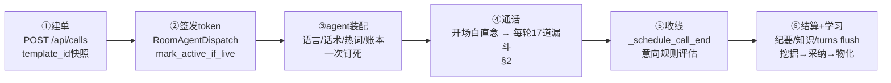

# A 线完整工作逻辑（代码级追踪版）

> 2026-09-20。本文不是 AGENTS.md 军规复读，而是对 A 线源码的**逐行追踪综合**：四路并行深读
> （agent.py 4804 行 / flow.py 1522 行 / qa_gate.py / fillers.py / livekit_plugins.py 5961 行 /
> control_plane main.py / repository.py），全部结论带 `文件:行号` 证据。全局组件拓扑见
> `bok-architecture.json`（archify），本文专注**运行逻辑**：什么节点做什么事、意图识别怎么判别、
> 数据在哪一列。
>
> 路径缩写：`AG`=apps/agent/agent_runtime/agent.py；`FL`=…/flow.py；`LKP`=…/providers/livekit_plugins.py；
> `QG`=…/qa_gate.py；`FD`=…/fillers.py；`CP`=apps/control-plane/control_plane/main.py；
> `RP`=packages/business-db/bok_voice_business_db/repository.py。
> 注：上一会话修复分支 `session-20260919-232858-4eb7`（max_step_reached/_judge_health 降级/
> session_report CAS 等 18 项）**尚未合并**，本文行号基于 origin/main@3385529 + 本会话 web 分支。

## 0. 全景：一通电话的六个阶段

| 进程 | 端口 | 在通话里的职责 |
|---|---|---|
| CP (FastAPI) | :8000 | 建单/token/turns 收账/wa/assist/dial-result/settle/模板发布两态 |
| LiveKit | :7880 | 房间信令；token 挂 `RoomAgentDispatch(agent_name="bok-voice")` 派 worker（CP:1452-1463） |
| agent worker | :8081 | 装配+每轮漏斗+收线+turns 上报（AG `entrypoint` 1727） |
| ASR sidecar | :8787 | PCM→文本：句级提交/join-hold/热词；会话 TTL 180s（sidecar app.py:174-201） |
| TTS | MiniMax 云 / :8788 | bidi 长连接+看门狗；`CachedTTS` 键=text+voice+model 精确 sha1（TC:66-84） |
| LLM 4B | :1235 | 实时回复；KV 严格前缀契约（LKP:1772-1915） |
| LLM 9B | :1237 | 后台岗：flow judge / 意图判据 / 结算纪要（缺盘回退 :1235） |

## 1. 装配阶段（AG:1727-2830，会话级钉死）

| 钉死项 | 实现 | 证据 |
|---|---|---|
| 话术来源 | call.template_id 快照 > 对象卡绑定；机器通道 GET 模板 → `_template_machine_overlay` **冻结 published_json 覆盖 live** | AG:1777-1783；CP:4110-4119、4077-4096 |
| 语言 | `PinnedLanguageState`+`set_user_language` 一次写入，整通不切换 | AG:1976-1985 |
| 流程引擎 | `FlowController.from_template`：steps_json（空则旧四段转步）+ object_vars（单号逐位转汉字）+ graph 宽容解析 | FL:902-909、233-249、252-288 |
| 热词 | 模板+行业+对象三层 ≤200 字，随 /api/start 下发 sidecar | AG:2269；LKP:5486-5495 |
| 对象档案 | `_wire_object_brief` ≤2 行静态进前缀 | AG:1790、1612-1630 |
| 意向规则 | `cp.list_intent_rules` 拉到 worker 内存（评估在 agent，CP 只存） | AG:2824-2830 |
| QA 索引 | 有 TTS 缓存且（快路开 或 图有 play_qa 绑定）才建 `QaIndex` | AG:2787-2820 |
| 钩子注册 | metrics/item_added×2/close/shutdown×2/心跳×2/partial 闸/spec busy/speech_created——**全部先于 session.start**（start 在 4683） | AG:3122-4677 |
| 开场白 | 第 1 步 ref 首行直念（变量缺失退通用语）；`_prefix_prewarm_task` 用 turn-1 同构形状与 TTS **并行**预热 | AG:4716-4748、2835-2869 |

## 2. 每轮意图漏斗（AG `on_user_turn_completed` :3500 起，**按代码实际执行顺序**）

前置：框架 turn commit（STT 句级 FINAL 路径，见 §4）→ 钩子。17 道闸，前者命中即短路：

| # | 闸门 | 证据 | 命中行为 | 推进 |
|---|---|---|---|---|
| 0 | 心跳归零/disarm/filler.cancel/看门狗武装 | AG:3511-3518 | — | — |
| 1 | 回声自听守卫：speaking 中+两边≥6字+相似≥0.9 | AG:3558-3567、1092-1112 | 整轮丢弃 | 否 |
| 2 | 热词词表回声守卫（剥尾保头） | AG:3578-3596 | 丢弃或改写文本 | 否 |
| 3 | 暂停冻结 | AG:3607-3620 | 落库 gen=paused | 冻结 |
| 4 | 打断风暴静听（resume/ack/silent） | AG:3629-3686、694-718 | ack=直念短承接 / listen=静默 | 否 |
| 5 | 饿死兜底（连续2轮零输出） | AG:3694-3726 | 直念 starve_ack | 否 |
| 6 | WA 收号碎片累积（<8位数字主导/自报头→stash+5s flush） | AG:3727-3777、2029-2085 | stash：不回复不推进 | 否 |
| 7 | 通用单号累积（非 WA 步） | AG:3783-3824、2093-2138 | 同上 | 否 |
| 8 | WhatsApp 信号检测（captured/captured_implicit/offered；already_captured 防确认轮锁死） | AG:3825-3864；FL:674-739 | 静默记账+上报 | 否 |
| 9 | 事实沉淀 extract_call_facts→尾部 | AG:3868-3872 | — | 否 |
| 10 | **规则 verdict**（顺序：REFUSE→FAREWELL→auto/CONFIRM→UNCLEAR/QUESTION） | AG:4084-4241；词表见 §3.1 | **REFUSE→closing+14s 收线；FAREWELL→closing+8s**（两者仍落穿 LLM 念收尾稿） | REFUSE/FAREWELL/CONFIRM 是 |
| 10b | **分支动作早段派发（A-②，2026-09-20）**：`branch_hit_plan` 命中且应答带动作前缀 → `【收线】`=镜像 REFUSE 车道（enter_closing+`_schedule_call_end()`+有台词时直念台词后 StopResponse）／`【转人工】`=镜像 notify 臂（打铃不抢话、不 hold）／`【跳第N步】`=镜像 graph jump 三件套（位移才记账、置 `_flow_step_before=-1` 压 QA）；`【留本步】`与无标记分支只置 `_branch_hold` 并保留计划给 14b | AG:4114-4240；FL:107-160 `parse_branch_action` | 动作派发；收线带台词=直念不出 LLM | 【收线】/【跳步】/【留步】=本轮规则推进让位 |
| 11 | stall 阶梯（同一步 UNCLEAR 3/5/8 次→degrade/bypass/close） | AG:4007-4048；FL:550-561 | 罐头直念；close=告别+8s 收线 | close 置 closing |
| 12 | DEFER 短应承（社交拖延，先于 CONFIREM 判） | AG:4055-4077；FL:814-815 | 直念 defer_ack | 否 |
| 13 | **say 直念步待念门**（#10 前已采样防被规则推进吞掉） | AG:4085-4128；FL:1096-1106 | 直念正稿首行+interrupt+官方 C5 补轮 | 记账不推进 |
| 14b | **分支罐头腿（A-①，2026-09-20）**：消费 10b 留下的计划（`BOK_BRANCH_ACTION=0` 时自行以 `action_enabled=False` 求值＝A-① 原姿势）——应答已物化（缓存键与 `_say_script` 同源）→ 播录音不过 LLM；未物化 miss 落穿 | AG:4465-4540；FL/AG `branch_hit_plan` | 罐头 ~50ms（gen=script/provider=branch-canned） | 否 |
| 14 | **graph 意图块**（gate：开关+有 intents+非 closing+有文本）：judge pending **先取即清** → jump_step（位移才烧 once，置 `_flow_step_before=-1` 压 QA）→ notify_human（打铃不抢话）→ play_qa（条目+PCM 双在才罐头；miss 不烧 once 放行）→ 关键词未中才调度意图 judge | AG:4180-4326 | jump/then_jump 推进；play=罐头出口 | jump 是 |
| 15 | **QA fastpath**（graph 之后）：四道闸 → match → 簇轮换 → `_qa_canned_say` | AG:4333-4409；闸表 §3.3 | 罐头 ~50ms | 否（advanced 闸挡） |
| 16 | paused 兜底 | AG:4412-4413 | — | — |
| 17 | **filler.arm()**（只在确定走 LLM 的轮 arm；真回复首音频撤表） | AG:4417；FD:433-445 | 之后框架 generate_reply | — |

LLM 轮的兜底链：首 token 2s→流内道歉句（垫话已盖耳则抑制，AG:2753-2755）→弃流重生 late-answer→4s 响应看门狗 force interrupt+兜底直念（AG:2161-2212）。垫话本身走 `BackgroundAudioPlayer` 独立音轨（不经 speech 队列——session.say 串行会令轮提交停摆，FD:481-488 实证注释），回复首帧按「垫话剩余+gap」扣压实现播放排序（TC:379-390；FD:470-479）。

**用真实例子走一遍漏斗**（第 1 步「你好，請問係{姓名}嗎？」的三条分支）：

| 客户说 | 实际路径（2026-09-20 起，含 A-② 分支动作） | 走 LLM？ |
|---|---|---|
| 「咩話？你再講一次」 | #10 verdict=UNCLEAR/QUESTION→#10b 分支「听唔清」命中（无动作）→#14b 该应答已物化则**播录音**、未物化则落 #11 计数→#17→LLM（分支仍按 bigram 注入提示词） | 视物化而定（**运营补录即零 LLM**） |
| 「打錯電話／唔係本人」 | 模板分支写成「如果客户打错电话→【收线】唔好意思，我哋核对下资料，拜拜」→#10b **早段拦截**：进收尾态+排 14s 挂断+直念该台词（零 LLM）。**未配该分支时**退回内置：#10 `_REFUSE_RE`（FL:356-362）→closing→LLM 念通用收尾稿 | **配了就不走**（未配走） |
| 「你係邊個？」 | #10 QUESTION→#10b 若配了「→【转人工】」则打铃+#17 LLM；否则 #10→#17→LLM（QA 库/分支恰有同说法且已物化才 ~50ms 罐头） | 走（打铃不抢话） |

**结论（2026-09-20 更新）**：零 LLM 的路现在有六条——say 直念步／脚本直念族／graph play_qa／QA 字面命中／**分支罐头（A-①）**／**分支动作【收线】直念（A-②）**；【转人工】与【跳第N步】是**副作用**（打铃 / 换步），本轮回复仍由 LLM 或后续快路产出——运营要「这句话直接放录音」，就在画布答法抽屉里给该分支补录（录音状态点+补录按钮）。

## 3. 判定器明细

### 3.1 verdict 词表（FL:316-389）
REFUSE `_REFUSE_RE`+`_HANGUP_RE`（软守卫「唔使担心」否决 366-369）｜FAREWELL `_FAREWELL_RE`｜OBJECTION `_DENY_RE`｜REPEAT（≤12 字）｜QUESTION `_QUESTION_RE`（需无 `_STRONG_AFFIRM_RE` 多字确认）｜DEFER `_DEFER_RE`（先于 CONFIRM 判，防「好的我查一下」抢跑）｜CONFIRM `_CONFIRM_RE`/`_STRONG_AFFIRM_RE`/答对资料。步语义：身份步(0)非拦即推；say 步非问即推；WA 步 captured 才推（`wa_confirm_advance_allowed` FL:590-595，rule/judge 两路共用）；平台步 `_PLATFORM_RE` 命中即推（FL:500-546）。

### 3.2 背景 judge 双管线
- **flow judge**（推进判定）：UNCLEAR/QUESTION 且 `FLOW_LLM_ADVANCE=1`→3s 让路→9B :1237（timeout 5s，AG:184-186）→守卫链（同同步+非 done+非暂停+非 say 待念）+双闸（judge_confirm/WA）→`advance()`（AG:3253-3389）。同一步同时只允许一个 judge（`_judge_inflight` AG:2215、3985-3986）。
- **意图 judge**（关键词补位）：图块求值且关键词未中→六闸（开关×2/非 closing/有文本/单飞/无 pending）→批量单次调用（max_tokens=32、**timeout 20s** AG:3436）→写 `_gjudge_pending`，**下一轮图块先取即清**（single-shot，过期打 judge_pending_expired，AG:4190-4220）。

### 3.3 QA 快路数学（QG）
匹配只吃 `question_text` 归一化（QG:139-150）；分数=0.6×余弦+0.4×(q⊂e_q 长度比)（QG:248-251）；阈值 0.90（QG:36-40）；胜者键=(priority, -score) 取 min（QG:256-258）。**四道闸** `qa_exclude_reason`（QG:99-133）：advanced（本轮已推进）> closing/done > wa_signal > wa_step_locked > digits(≥4位) > refuse > verdict∉{确认,模糊,提问}。簇轮换：cluster_head_id 折组→head 代表出场→簇内最少播放者先（QG:165-176、86-96；账本 `qa_played` 真播出才记 AG:1424-1432）。

### 3.4 分支注入（渐进披露，FL:136-155、167-202、1177-1254）+ 分支动作（A-②，FL:107-160）
`parse_step_ref`：正稿=首个非空行；分支=「如果客户…→…」；注意=「注意：」。轮渲染时：正稿只进本步**首轮**（`_last_render_step` 账本），此后分支按 verdict+客户原话**只命中单条**（同族词表优先，bigram≥2 跨族兜底，全不中不注入），注意恒注入前 2 条。**渲染账本靠调用纪律保命**：`current_step_text` 全仓 6 个调用点每次都烧账本——新增调用点=渐进披露静默退化（FL:1177-1180）。

**动作前缀**（应答首部，可省）：`【收线】`（别名`【挂断】`→refuse）／`【转人工】`（handoff）／`【跳第N步】`（jump，1-based；`跳第0步` 标记被消费但按无动作处理）／`【留本步】`（hold，纯文档性=默认语义）。`parse_branch_action(resp)→(action,step,text)`（FL:107-160 纯函数）；出声文本=剥标记后渲染。**执行语义**在漏斗 #10b：动作分支**早于** verdict 车道求值（所以「打错电话→【收线】」不会被内置 REFUSE 抢走），`hold=True`（除 handoff）抑制 #10 的规则自动推进=**真·留本步**；无标记分支不 hold、计划交给 #14b 罐头腿。plan 闸门（`branch_hit_plan`，AG:423-505）：总开关／paused／done／closing（仅放 refuse）／空文本／WA 步未捕获（与 QA 快路 `wa_step_locked` 同语义）／**第 1 步只放 refuse+handoff**（身份步「非拒绝即推进」铁律）／`verdict∈{REFUSE,FAREWELL}` 只挡无动作分支。kill-switch `BOK_BRANCH_ACTION`（默认 1；0=早段整块不评估、罐头腿回 A-① 原姿势）。观测：`BRANCH_ACTION refuse|handoff|jump|jump_noop|hold`、`BRANCH_CANNED hit|miss`。

### 3.5 KV 前缀契约（LKP:1549-1915）
请求=静态前缀（语言/节奏/准则/总览/对象档案，整场字节不变）+历史+每条 user 拼当时的易变尾部并由 `_applied_tails` 账本**冻结重放**；末条 user 在 revision 变化（推进/捕获号码）或转写修正时重锚（LKP:1841-1872）。框架的 `[流程状态]` 标记出请求流剥离。铁律=上一轮请求是下一轮严格前缀。

## 4. 语音层（LKP `_Qwen3ASRLiveStream` :5196 起）

音频→VAD→事件链：START（pre-roll 并入 `_pending`）→ INTERIM（300ms 节流滑窗）→ PREFLIGHT（稳定前缀≥6字，喂字幕+PrefillSpeculator）→ **句级 FINAL**（三档：强标点 ≥6 字+无 ASCII run+跨窗稳定 / vad-pause ≥10 字 / B 线子句·长度档默认关；限速 1.5s）→ END_OF_SPEECH（join-hold 抑制时不出）→ finish 整句修正。**join-hold**（LKP:5330-5350）：EOS 时尾部像「没说完」（数字≥2位/系词/热词前缀）→ 不发 EOS，800ms 窗等续段并入同一会话。**重解丢弃**：finish 与已提交不构成前缀且相似≥0.55 → 判同段更好重解丢弃（LKP:5772-5845）。**回声双闸**：STT 流层 `_vocab_echo_guard`（剥尾保头，四闸口 LKP:5250-5270）+ 框架层自听守卫（AG:#1）。会话级 partial 抑制：thinking/speaking 时 partial 间隔抬到 3s（AG:4579-4590），治 GPU 争用拖慢 TTFT。

## 5. 收线 / 结算 / 意向归因

**收线六源**（全部汇入 `_schedule_call_end` AG:3325，幂等闸 `_end_scheduled`）：REFUSE(14s)/FAREWELL(8s)/stall-close(8s)/心跳 farewell(12s, no_response)/**分支动作【收线】(14s，A-②)**/时长熔断+拨号失败(直接 cp.end_call)。**客户挂断**走 session close→`_close()`：session_report→gather 上报任务池（**窗口自适应**：无慢任务 10s；有在途意图 judge 时按该任务预算 20s+5s 余量，`BOK_SETTLE_WAIT_S` 可覆盖；超时打 `SETTLE_WAIT_TIMEOUT`）→`cp.settle`。**意向评估在 agent**：`_schedule_call_end` 内 `_intent_facts_snapshot`（12 键账本 AG:517-536）×内存规则表→`evaluate_intent_disposition`（(priority,id) 首中、conditions AND、缺键保守）→`cp.end_call` 带 intent_code/disposition（CP:113-131 落列）。**CP 结算** `_settle_core`（CP:3325-3463）：幂等短路→零轮回填→usage 累加→Summarizer 纪要（9B）→对象 digest→知识蒸馏入库（审计 knowledge.distill）→挂断 SMS 钩子（默认关）。

**turns 账本**（CP:1855-1903）：统一经 `conversation_item_added`（AG:2880-2933）。`gen` 全集：`llm`｜`script`（直念族：开场白/心跳/farewell/watchdog/late-answer/starve/stall/defer/say 步/WA flush）｜`qa_fastpath`｜`filler`｜`paused`｜`interrupted`；`provider` 细分归因（graph-play/graph-jump/graph-notify/qa-fastpath/storm-ack/…）。user 轮 gen 恒空。**这就是快路覆盖率的原始数据。**

## 6. 学习回路（现状 + 已拍板扩展）

现状：真实 turns → `mine_qa_pairs` → `POST /api/qa/cluster` dry（LLM 三列：变体/新/垃圾；缓存键 (account,min_calls,limit) TTL 600s；单飞 409）→ 人工勾选 apply（owner 盖章+逐行审计；created>0 清全账号缓存）→ `tts-pregen --qa` 物化（pin=True 永不逐出 TC:173-237）→ 下通电话快路生效。

**L-① 已落地（2026-09-20）：漏网轮挖掘 + 快路覆盖率驾驶舱**。`GET /api/stats/llm-gaps`（`_gate_page("reports")`+`scoped_account`；CP 新模块 `gap_mining.py`，零 SQL 全走仓储公开方法）返回 `{coverage, gaps}`：coverage 只数 A 线**回复轮**（gen∈{filler,interrupted} 剔除，`gen∈{script,qa_fastpath}` 判快路，provider 只进 `by_provider` 细分——**注意 provider=graph-jump/branch-jump/branch-notify/stall-N 的轮回复仍由 LLM 产出，不能按 provider 判快路**）；gaps = 「AI 轮走了 LLM」的前一条客户轮文本，归一化聚合（复用 `qa_text.normalize_question`；排除 <3 字/应承语族/数字主导/测试对象）后按 count 降序 + `min_calls` 门槛，带 `sample_answer`（当时 LLM 实际说的）+ `lang`。`POST /api/stats/llm-gaps/adopt` 复用 `POST /api/qa-entries` 同一条仓储/盖章/审计路径（审计 `qa_entry.create` detail.source=gap-adopt，同 question+lang 幂等）——**人工确认（answer 可编辑）后才入库**。web 在 studio「场景学习」tab 的 `components/gap-mining.tsx`（覆盖率大数 + 漏网轮候选表 + 采集）。已知口径：adopt 恒落 `scope=global/step_index=-1`，因为 `qa_gate` 里 `int(step_index or -1)` 的 falsy 奇点会让 `step_index=0` 永不命中（见 D14）。

## 7. 问题清单（代码追踪产出，分三级）

### D 级：本轮代码追踪新发现的真问题（带行号，按严重度）

> 修复状态（2026-09-20）：**D1/D2/D3/D5 已修**（波1）+ **D4/D7 已修**（波3）；其余待排期（D6/D8 涉产品口径，拍板后再动）。

| # | 问题 | 证据 | 影响 |
|---|---|---|---|
| D1 ✅已修 | **发布冻结在开发态被静默违反**：`_template_machine_overlay` 只在 `request.state.machine` 时生效，而该标记只在 auth-on 且 Bearer==BOK_CP_TOKEN 时由 identity_gate 打——auth-off 开发栈与 CP-token-only 形态下 agent 装配拿到 **live 草稿**，不是 published_json | CP:4117 + auth.py:291-296 | 本地/E2E 全量测的「不是发布行为」，冻结不变量零覆盖 |
| D2 ✅已修 | **看门狗/垫话可整通静默关闭**：`_arm_response_watchdog` 只在 TTS 被包成 CachedTTS 时武装；装配缓存失败（_tts_cache=None 且 FallbackAdapter 未包）→看门狗+垫话拆弹+垫话功能全关，仅一行日志 | AG:2188-2190、2423-2425 | 云 TTS 卡死时「每问无答」自我修复失效且无告警面 |
| D3 ✅已修 | **campaign 接通率口径与仪表盘自相矛盾**：progress 的 answered=done+no_answer+rejected，把未接通也算接通；dashboard 用严格排除口径 | CP:2485 vs 4269-4271 | 战役 UI 接通率虚高，误导外呼策略 |
| D4 ✅已修 | **ASR chunk POST 先清后发**：`_maybe_partial` 先 `_pending.clear()` 再 POST，异常静默 return——该窗 PCM 永久丢 | P_LKP:5564-5620（实际路径 `agent_runtime/providers/livekit_plugins.py`，非文档旧写的顶层） | 已改「**成功才删已发前缀**」；失败保留整窗+12s 有界截断+`QWEN3_ASR_CHUNK_POST_ERR` 打点；`QWEN3_ASR_CHUNK_KEEP=0` 回退。sidecar `/api/chunk` 是**追加式**（重复提交=重复转写），故不主动重发、随下一窗/finish 自然带上 |
| D5 ✅已修 | **judge conf 缺失按 0.7 放行=自动够建单线**：`parse_judge_route` 对 route 有值但 conf 缺失默认 0.7，`FOLLOWUP_CONF_MIN=0.7` 且比较用 ≥ | FL:1451-1452、1458 | 9B 偶发省略 conf 即自动开跟进单，打扰人工 |
| D6 | **WA 步误捕获面宽**：裸词「号码」即 WA 语境+任意 4-13 位 run 即 captured，已知号过滤只兜整串/≥8位尾 | FL:710-717、660-671 | 客户报 4 位碎片（验证码式）被当 WhatsApp 号上报 |
| D7 ✅已修 | **结算窗掐死慢 judge**：`_close` gather 上报任务 10s，意图 judge timeout 20s 且同池——慢判定轮静默丢失 | AG:3326-3344 vs `_background_intent_judge` | 窗口自适应：无慢任务仍 10s（收线不被拖慢）；有在途 judge（`_spawn_report(..., slow_s=20.0)`）抬到 `max(10, 20+5)`；超时打 `SETTLE_WAIT_TIMEOUT`（任务名+等待）；`BOK_SETTLE_WAIT_S` 覆盖 |
| D14（新） | **env 白名单扫描面非递归**：`tests/test_forward_env.py` 用 `_AGENT_DIR.glob("*.py")`，`agent_runtime/providers/**` 的读取面从未被扫——实测 `providers/livekit_plugins.py` 有 **61 个键**（`MINIMAX_*`/`QWEN3_ASR_*`/`LLM_*`/`VOLC_*`/`BOK_REPEAT_GUARD` 等）不在 `_FORWARD_ENV`/bok 注入面/豁免清单；这些「运营逃生门」在 dev 靠 `os.environ` merge 活着、prod 封闭 env 下**结构性不可设**（同 2026-09-19 `BOK_FLOW_GRAPH` 实弹教训） | tests/test_forward_env.py:41；`providers/livekit_plugins.py` | 把扫描改 `rglob` 后需一次性审计 61 键：真运营开关进 `_FORWARD_ENV`、纯内部回退（`FAKE_STT_TEXT`/`MINIMAX_API_KEY` 等）带理由进豁免；**未做**（避免顺手扩大面），待排期 |
| D8 | **CP 抖动→跨账号污染**：上下文解析异常吞成 call=None 照跑，账号兜底 acc-001——垫话/QA 罐头从错误账号拉 | AG:1793-1794、2762-2763 | 多账号下串资产+幽灵 job 拒接被旁路 |
| D9 | ** turns 双记**：WA/单号碎片 stash 轮 + flush 合并轮各落一行 | AG:3755/3802 vs 2050/2112 | 分析侧不去重则轮次虚高（快路覆盖率被稀释） |
| D10 | **意向 duration_s 含拨号等待**：t_start_wall 在装配打点，非接通时刻 | AG:2000、3199 | 「通话时长≤10s」类意向规则系统性偏大 |
| D11 | **并发非原子窗口**：session-report 幽灵守卫与 whatsapp 状态机均为读-判-写非原子（`mark_active_if_live` 已示范正确做法未复用） | CP:4479-4499、1914-1937 | 并发双写 last-writer-wins |
| D12 | **auth-off 下 turns/qa-hit 无防**：add_turn 无长度/角色/审计；qa `/hit` 无闸（filler 版补了，qa 版漏配） | CP:1855-1903、3706-3711 | 匿名可灌轮次污染挖掘语料与指标 |
| D13 | 卫生组：死 API（flow.on_user_turn/apply_judge_verdict 零调用）、_judge_route 只写不读、每 300ms 冷建 httpx client、热词走 URL query、账本集无界、pregen 状态缓存全局单份跨账号、settle 穿透仓储、update_call 零枚举 setattr、redispatch 锁 TOCTOU、投机预热尾部必然分叉 | FL:935/1047；AG:2216；LKP:5538/5493；FL:925；pregen.py:177；CP:3373/1430/4631；spec.py:100-109 | 单列待清 |

### A 级：架构级（用户视角「串不上」的根源，已拍板路线）

| # | 问题 | 路线 |
|---|---|---|
| A1 ✅已落地 | 步骤分支命中只改提示词、永远走 LLM（§2 例子表实证）→ **分支罐头快路已实现**（2026-09-20 波2）：say 直念门之后、graph 块之前插入——分支匹配+应答已物化（tts 缓存键与 _say_script 同源）→ 播录音不过 LLM（gen=script/provider=branch-canned，不推进流程）；未物化落穿照旧。开关 BOK_BRANCH_CANNED（默认 1，入 _FORWARD_ENV）；物化走 pregen_tts --branches（人设保存自动物化已带上）；11 用例钉住。**波4 起位置随 A-② 前移**（见 A2），`BOK_BRANCH_ACTION=0` 时回原姿势 | — |
| A2 ✅已落地 | REFUSE/FAREWELL 语义内置、界面无配置口 → **分支动作集已落地**（2026-09-20 波4）：`【收线】/【转人工】/【跳第N步】/【留本步】` 应答前缀，`branch_hit_plan` 早段求值（先于 verdict 车道）+`_branch_hold` 抑制本轮规则推进；画布答法抽屉下拉+步号输入+分支 chip 徽标；`BOK_BRANCH_ACTION` 总闸；「打错电话→做客服道歉收线」现在可配（模板写「如果客户打错电话→【收线】…」） | 遗留：动作分支的多语言/多模板批量配置靠运营逐条写 |
| A3 部分落地 | 一个心智模型（这步客户这样说怎么办）碎在三个配置面（分支/问答/意图）→ **画布已成为分支的唯一编辑口**（动作+台词+录音状态+补录都在答法抽屉），QA/意图仍是独立 tab 但画布步节点有 jump 入边/徽标 overlay + 深链；口径=分支=步内应对，QA=跨步通用，意图=复杂路由 | 遗留：意图只在画布只读（编辑仍在 /studio 意图管理 tab） |
| A4 部分落地 | 学习回路只产词条；图词/分支/改答案无产出 → **L-① 漏网轮挖掘 + 快路覆盖率已落地**（§6）；图词/分支提案（L-②）与「改答案/删词条走通知、人工确认后自动填入」（L-③）待做 | 遗留 L-②③ |
| A5 | 总览把每步 ref 首行常驻静态前缀 vs 渐进披露对抗逐字引力——叠提示词补丁而非数据面解法（模板越长越脆） | 待议：总览只给目标不给事实行 |
| A6 ✅已落地 | 快路覆盖率无指标（gen 数据全在、无人消费）→ `GET /api/stats/llm-gaps` + studio「场景学习」tab 驾驶舱（L-①，§6） | — |

## 8. 真栈实弹验收（2026-09-20，A-①②③ + L-① + D4/D7）

离线单测不算验收。本轮在**真栈**（真 LiveKit + 真 ASR/LLM + 真 MiniMax TTS，A 线 worker 换成施工分支代码）上跑真通话与真点击，证据落 `/tmp` 与 `reports/branch-action/`。

### 8.1 探针 `scripts/probe_branch_action.py`（六腿，每腿一通真通话）

建自己的模板（6 步中文，第 2 步五条动作分支）+ 真 `/api/token` 建单 + TTS 渲染客户语音推流 + 按字节偏移切 agent.log + 拉 turns + `call_sessions` 对账；`--selftest` 离线自检 40 例，`--expect-off` 为 kill 腿。

| 腿 | 结果 | 硬证据（真通话） |
|---|---|---|
| `canned` | PASS | `BRANCH_CANNED hit step=2`；turns `gen=script provider=branch-canned`，文本与分支应答**逐字一致**；首声 1.21s（零 LLM） |
| `refuse` | PASS | `BRANCH_ACTION refuse step=2`；turns `gen=script provider=branch-refuse` 文本=台词逐字；该行是全通最后一条 assistant 行（收线前零 LLM）；`status=ended disposition=declined`；提交→挂断正好 14.0s（与 `_schedule_call_end(14.0)` 一致） |
| `handoff` | PASS | `BRANCH_ACTION handoff step=2`；`call_sessions.assist_status="notified"` 真落库；触发轮仍 `gen=llm`；后续中性轮正常应答（打铃不掐） |
| `jump` | PASS | `BRANCH_ACTION jump step=5`；同轮 `provider=branch-jump`、回复已是第 5 步内容；下一轮同位自跳语 → `BRANCH_ACTION jump_noop step=5` 且窗口内零 `jump` |
| `hold` | PASS | `BRANCH_ACTION hold step=2` + 同轮罐头「好的，您慢慢看」；触发与验证窗口零 `rule=auto/confirm`、验证轮 `template_step` 仍=2（**真·留本步**） |
| `kill`（`BOK_BRANCH_ACTION=0`） | PASS | 窗口零 `BRANCH_ACTION`、零 `BRANCH_CANNED hit`（仅 `miss`）、零 branch-* 轮、零 `template_step=5`；恢复默认档后 canned 腿复现 → A/B 闭合 |

物化：`pregen_tts.py --branches` 真云合成（`new=1` 首跑、`skip=1` 复跑）、音色与运行时 `MINIMAX_TTS_VOICE` 逐字同源、`--branch-status` 复核 `ok`。

### 8.2 CP 新端点（真库副本 + 独立端口）

- `branch-canned-status`：74 条真实分支键与 `/api/templates` 逐字双向零差异；65 missing / 9 ph（`{占位}` 残留）/ 0 ok＝**判定诚实**（当时确实没物化）；跨账号缓存分键实测不串；首打 1.3s（spawn）、缓存命中 ~2ms。
- `llm-gaps`：`turns=190 fastpath=86 llm=104 ratio=0.4526`，与副本库 SQL 逐数复算一致；`gen=filler(436)/interrupted(2)` 真存在且**已被剔出分母**（口径生效）。
- `gaps` 口径抽查 2/2：客户原话的下一条 AI 轮确为 `gen=llm` 且文本与 `sample_answer` 逐字一致（中间 filler 行被正确跳过）。
- `llm-gaps/adopt`：201→同参 200 幂等同 id；副本库确认唯一一条 `source=gap-adopt`、`scope=global`；审计落 `qa_entry.create`。

### 8.3 浏览器真点击（本分支静态导出 + 上面那台 CP）

- 侧栏分组=「AI 设置」（AI 工作站/知识库/人设）**已生效**；8 个 tab、右上「已保存 ✓/应用/发布」在位。
- 画布=纵向步骤工作流（第 1 步在上 +「● 电话接通先讲这一步」徽标 + 步间「默认推进」线 + 分支 chip）。
- 答法抽屉真开：条件框 + **五项动作下拉**（按内容回答/礼貌收线/通知人工/跳到第 N 步/留在本步）+ 应答文本域（**不含标记**）+ **录音状态点「未录」** + 补录 + 删；变量按钮一排；「改动记入右上角未保存」提示在位。
- **写回闭环**：抽屉里给「说出了货品」行选「礼貌收线」→ 应用 → 服务端 ref 真变 `→【收线】认真听，简单回应一声…`（文本零丢失），且 **`published_json` 未被改动**（发布冻结不变量在真栈成立）；重载后重开抽屉，该行下拉**回读为「礼貌收线」**；改回默认再应用 → 服务器标记剥掉、文本完好。往返无损。
- 场景学习驾驶舱：界面 `46% / 39 脚本录音直出 / 46 AI 现场组织 / 85 回复轮合计` 与 UI 同参 API（`turns=85 fastpath=39 llm=46 ratio=0.4588`）**逐项一致**；候选行带「出现 3 轮 · 涉及 3 通 · 第 3 步 · AI 当时说 · 可回听通话 id」；点「采集为问答词条」→ 确认框预填当时那句 → 确认 → `✓ 已采集` + 幂等人话提示；`qa-entries` 复查同问法**仅 1 条**（无重复）。
- 录音沉淀 tab：空态 + 新增引导「分支录音…在主流程画布的答法抽屉里查看/补录」在位。
- 全程控制台 0 报错、0 未捕获异常、CP 侧 **0 条非 2xx**。

### 8.4 验收发现（新，未修——按优先级）

| # | 发现 | 影响 | 建议 |
|---|---|---|---|
| F1 | **人设 account_id 取 body 不取 query**：`POST /api/personas` 不带 account_id 时落 `account_id=""`，`/api/personas` 列表看不到它 → `pregen_tts --persona` 找不到人设 → 回落默认音色 `moss_audio_*` → 缓存键与运行时错位（`--branch-status` 报「假 ok」）。探针首轮即被此坑：以为物化好了、运行时却 miss | 运营补录录音可能「看起来 ok、实际永远不播」；`probe_flow_graph.create_probe_call` 同款隐患 | 人设端点按 `scoped_account` 兜底 body/query；状态端点把「音色与运行时不同源」判为 `ph`/warning |
| F2 | **迟到 ASR 修正轮掐断快路回复**：裸句尾推流时 sidecar 整窗重解在句尾幻听「那。」→ 迟到 FINAL 修正轮 interrupt 掉正在播的罐头（0.4s 掐断、assistant item 不落库、`_turn_origin` 戳被后续轮消费） | 快路/直念线在「迟到修正」竞态下丢轮次行 + 听感截断 | 归档到 STT 修正判定面（与 D4 同族） |
| F3 | **`_turn_origin` consume-once 戳在 late-answer 兜底下必丢**：LLM 慢轮（>2s）触发 late-answer 时，早段盖的 `provider=branch-notify` 被兜底轮消费/覆盖 → 真答案行 provider 为空 | branch-notify/handoff 的**归因面**（turns provider）在慢 LLM 下不可靠（行为本身正确） | 观察项；若要硬归因，戳应随轮次 id 绑定而非 consume-once |
| F4 | **热词偏置抄词**：「…我还想想」的弱尾音节被 ASR 直接抄成词表里的「打错电话」→ 意外命中【收线】分支并收线 | 与既有「极低内容音频抄词表」同类；分支动作让后果更重（误收线） | 已在 AGENTS 记录过；分支动作侧可考虑 refuse 前要求非 REFUSE 轮也过一次 verdict 一致性 |
| F5 | 画布默认缩放太小（8 步拥挤，文字需放大才读得清） | 普通人第一眼「看不清」，与「易用性为主」冲突 | 默认 fitView 后给最小缩放或让画布更高 |
| F6 | 引导语写「左边意图卡=听到某些话就跳到箭头指的步骤」，但库中 7 个模板 `graph_json` 全空 → 左栏永远为空 | 引导与现实不符，用户以为坏了 | 空图时隐藏该半句或给「还没有意图，去意图管理添加」空态 |
| F7 | 点「应用」保存后**答法抽屉自动收起**（选中态被重置） | 连续改多条分支要重开抽屉 | 视觉/交互体验项 |
| F8 | 保存会把整步分支行的「 → 」归一成「→」（无丢字，但运营未编辑的行也被改写） | 审计/版本 diff 出现非本意变更 | 序列化时保留箭头原空格（可让分支行保存原文） |

