# Bok Voice 界面使用手册（页面级图解）

读者：话务员 / 主管 / 运营。本手册按「对着屏幕找得到、照着步骤点得动」编写，截图取自运行中的真机系统（1440×900）。**除 01b（话务员视角）外，其余截图均为 root（Platform Root）视角**，截图存于 `docs/assets/ui/`。界面文案以截图为准，点击后的行为以代码为准；两者有出入处在对应小节注明。

---

## 0. 名词速查（先看懂这几个词，后面的页面就好读了）

| 名词 | 意思 |
|---|---|
| 通话会话 | 一通电话的完整记录：转写、结算、状态都在里面 |
| 工作台 | 有两个含义：① 顶栏「进入工作台」= 接听/拨打电话的操作台；② 左侧导航「工作台」分组 = 会话/同传入口 |
| 对象 | AI 对话的「对方档案」——姓名、单号、地址、电话等，话术里的 {姓名} {快递单号} 就从这里取值 |
| 人设 | AI 的「我方身份」——称呼、公司、语气、音色 |
| 话术模板 | 分步骤的对话剧本；通话按步骤推进，可配意图和快答 |
| 直念步 | 话术里标了「电话接通先讲这一步」的步骤：进入该步时 AI 逐字照念（通知/赔偿承诺类合规内容用） |
| 分支 | 步骤里的「客户如果这样说 → AI 怎么做」应对行，可带动作（收线/通知人工/跳步/留步） |
| 意图 | 「听到某些话就做某事」的规则：关键词命中后播快答、跳步或通知人工 |
| 快答（罐头音） | 预先录好音频的标准回答：客户问法命中即直接播放，不经过模型现场生成 |
| 垫话 | 生成慢时先播的一句应承语（「嗯，我帮您查一下」），缓解等待 |
| 快路覆盖率 | 「照稿念」（脚本/录音直出）的回复占比，越高越快越稳 |
| 名册 · 认领池 | AI 捕获到的客户号码池，人工认领后跟进 |
| 意向码 / 处置 | 挂断时按通话事实给这通电话打的标签（如「已加WhatsApp」）与后续处理方式 |
| 演示档 | root 专用的云端 Realtime 演示通话模式（出境计费），普通业务不用 |
| 结算 | 挂断后自动生成纪要、沉淀知识、写通话结果的收尾动作 |

---

## 1. 这套系统长什么样

除登录页外，所有页面共用同一个骨架：

- **左侧导航栏**：按分组排列入口，底部有「收起导航」（收起后只剩图标轨，悬停图标显示名称）。截图 04/06/07/09/13 里导航只剩图标，就是点了「收起导航」后的样子。
- **顶栏**：左侧是当前页名；右侧依次是「● v0.1.0」（绿点=控制面在线，控制面失联时这里变成红字「控制面离线」）→ 当前登录人姓名 →「改密」→「退出」→ 黑色按钮「**进入工作台**」。
- **内容区**：页面主体。无权限访问的页面会显示「无权访问此页面，请联系主管开通权限」和一张「返回首页」卡。

「改密」点开是一个弹窗：填当前密码、新密码（至少 8 位）、确认新密码，点「修改并重新登录」——改成功后旧会话立刻作废，需用新密码重新登录。「退出」点了立即回登录页。

本手册的读法约定：

- 每页一节，配真机截图；「控件表」三列 = 界面上叫什么 ｜ 它是干什么的 ｜ 点下去会发生什么。
- 「操作步骤」是该页最高频的 2-4 个任务的编号动作；「常见坑」一行是实测最容易踩的地方。
- 截图未拍到但确实存在的弹窗/折叠卡，以「（截图未含，入口在 X 页的 Y 按钮）」标注。

### 三种角色看到的导航差异

导航按角色裁剪（对照截图 05-studio 顶部的 root 导航逐项列）：

| 导航分组 | 菜单项 | root（超级管理员） | admin（管理员/主管） | user（话务员） |
|---|---|---|---|---|
| 工作台 | 会话（/calls）、同传（/interpret） | 不显示（服务端仍放行，可输网址直达，作排障通道） | 显示（按其权限有效集） | 显示（需勾选对应页面键） |
| 运营 | 名册、外呼、对象、报表 | 不显示（同上） | 显示（报表需被授予） | 显示（报表默认关，主管可开） |
| AI 设置 | AI 工作站（/studio） | 不显示（同上） | 显示 | 显示（需话术键） |
| AI 设置 | 知识库、人设 | **显示**（截图 05 左侧「AI 设置」组） | root 下发了对应管理键才显示 | 永不显示 |
| 管理 | 主管台、员工、审计、设置 | **显示**（截图 05 左侧「管理」组） | root 下发了对应管理键才显示 | 永不显示 |
| 管理 | 节点 | **显示**（仅 root） | 永不显示 | 永不显示 |

要点：

- **root 是「平台控制台」形态**：导航里只有平台/管理面——截图 05-studio 左侧就是 root 的全部导航：「AI 设置」组（知识库/人设）+「管理」组（主管台/员工/节点/审计/设置），**运营页（会话/同传/名册/外呼/对象/报表/AI 工作站）不在 root 导航里**。root 要进话术与作业面：点顶栏「进入工作台」，或直接输入网址（如 `/studio/`、`/calls/`）——服务端对 root 全域放行，只是菜单不显示。**不要把 root 截图里的导航当成话务员会看到的样子**。
- **user 是「话务员台」形态**，导航以运营页为主。下图是话务员（演示话务员）登录后的真实界面：左侧「工作台」组（会话/同传）、「运营」组（名册/外呼/对象）、「AI 设置」组（AI 工作站）；该账号未开「报表」权限所以没有报表项；知识库/人设/主管台/员工/节点/审计/设置等平台管理页一概不显示。
- **admin 是「客户主管台」形态**：运营页全看（按有效集），管理页逐键由 root 下发，没下发就看不见——介于上两者之间。
- 本机单用户模式（未开认证）= 匿名登录，全部页面可见。
- 「找不到页面/无权访问」= 没权限，找 root 或主管开通（见附录）。

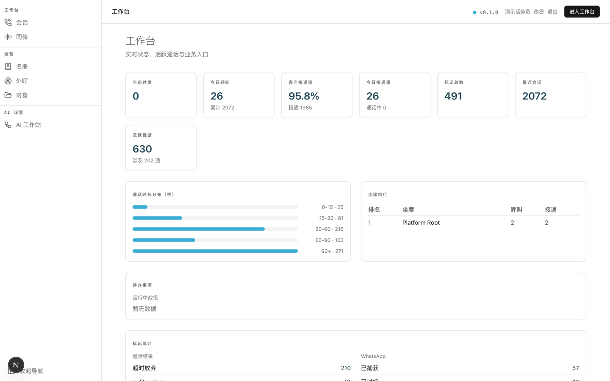

上图为话务员视角首页（工作台仪表：当前并发/今日呼叫/客户接通率/今日接通量/标记总数/最近会话、沉默谈话、通话时长分布、坐席排行、待办事项、标记统计），重点看左侧导航与 root 视角（截图 05-studio）的差异。

---

## 2. 逐页字典（按截图编号）

### 00 登录页

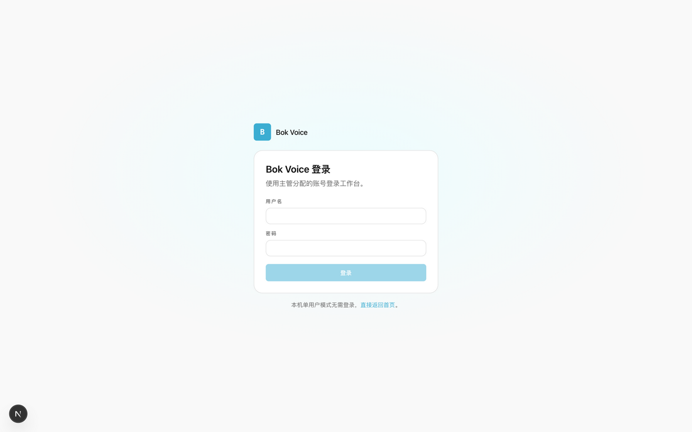

这页干什么：用主管分配的账号进入系统。谁用：所有人。

| 控件 | 作用 | 点了发生什么 |
|---|---|---|
| 用户名 / 密码 | 输入账号凭据 | 必填才能提交 |
| 登录 | 提交登录 | 成功=存令牌并跳到工作台首页；用户名或密码错误会红字提示 |
| 直接返回首页 | 链接 | 本机单用户模式（未开认证）无需登录，点了直接进系统 |

操作步骤：① 输入主管给的用户名和密码 → ② 点「登录」→ ③ 登录后默认落在工作台首页。

常见坑：连续输错不是锁定而是提示「用户名或密码错误」；忘记密码找主管在「员工」页重置。

### 01 通话会话（/calls）

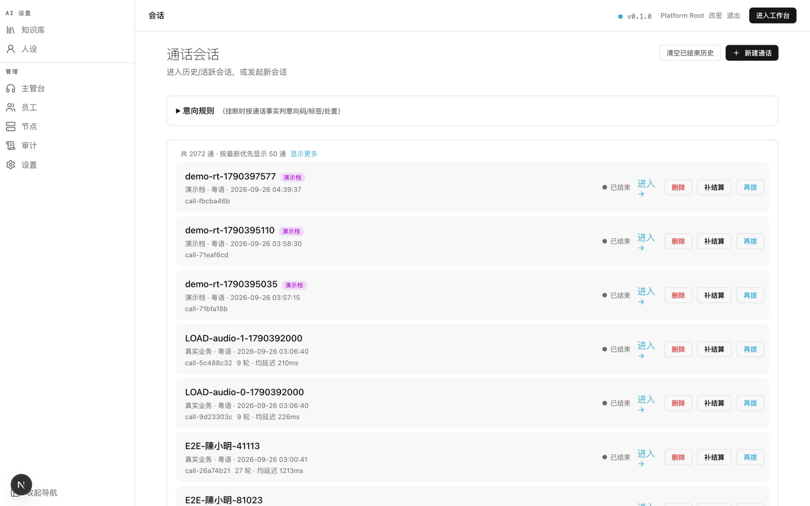

这页干什么：全部通话的列表与入口——进历史/活跃会话，或发起新会话。谁用：话务员日常主页面、主管回查。

| 控件 | 作用 | 点了发生什么 |
|---|---|---|
| 清空已结束历史 | 清理列表 | 弹确认框，确认后删除所有「已结束」通话（不可恢复） |
| ＋ 新建通话 | 发起新通话 | 跳「/calls/new」通话工作台 |
| ▶ 意向规则 | 折叠卡（挂断时按通话事实判定意向码/标签/处置） | 展开见表后说明 |
| 进入 →（行内青字） | 打开这通通话 | 同页内嵌通话工作台，可回放转写/结算 |
| 删除（行内红字） | 删单条记录 | 弹确认框；转写与结算一并删除 |
| 补结算（仅已结束行） | 漏走挂断结算的通话手动补一次 | 弹确认框；生成纪要/知识沉淀，完成后刷新列表 |
| 再拨（仅已结束行） | 用同一对象再打一通 | 跳工作台并预选该对象 |
| 显示更多 | 列表翻页 | 每次多显示 100 通（默认最新 50 通） |

行内信息：对象名 +（演示档徽标/WhatsApp 徽标）·「真实业务/训练/演示档 · 语言 · 时间」· 通话 id + 轮数与均延迟 · 状态点（进行中绿/振铃黄/已暂停蓝/已结束灰/失败红）。进行中的通话每 4 秒自动刷新，WhatsApp 待对接时整行闪烁。从主管台横幅点「进入工作台」也会落到本页并自动展开那通（`/calls?call=<id>`）。

点「进入」后是**同页内嵌的通话工作台**（截图未含）：左侧对象档案与人设摘要，右侧转写流与「接通/挂断」主控；已结束的通话在这里看转写回放与结算卡（刚挂断时结算可能还在后台生成，页面会自动重试几次再展示，稍等即可，不用刷新）。点「← 返回列表」回列表，列表立即刷新那通的最新状态。

意向规则折叠卡（截图顶部「▶ 意向规则」，展开后是表格+弹窗；studio「客户意向」tab 是同一张卡）：可新建规则——名称、意向码、标签、处置（可选）、优先级（数字小先命中）、启用开关、命中条件（每行=事实下拉/比较符/值，全部成立才判中，事实含时长/轮数/到达步数/是否捕获号码等 12 键）；主管还可建「全局（对所有账号生效）」规则。挂断时按优先级取第一条命中的启用规则写进通话记录。

操作步骤：① 回听一通：点行内「进入」→ 看转写/结算 → 点「← 返回列表」；② 补纪要：找已结束行点「补结算」；③ 再打一通：点「再拨」。

常见坑：列表只显示最近 50 通，老通话点「显示更多」；「删除」与「清空已结束历史」都不可恢复。

### 02 名册 · 认领池（/roster）

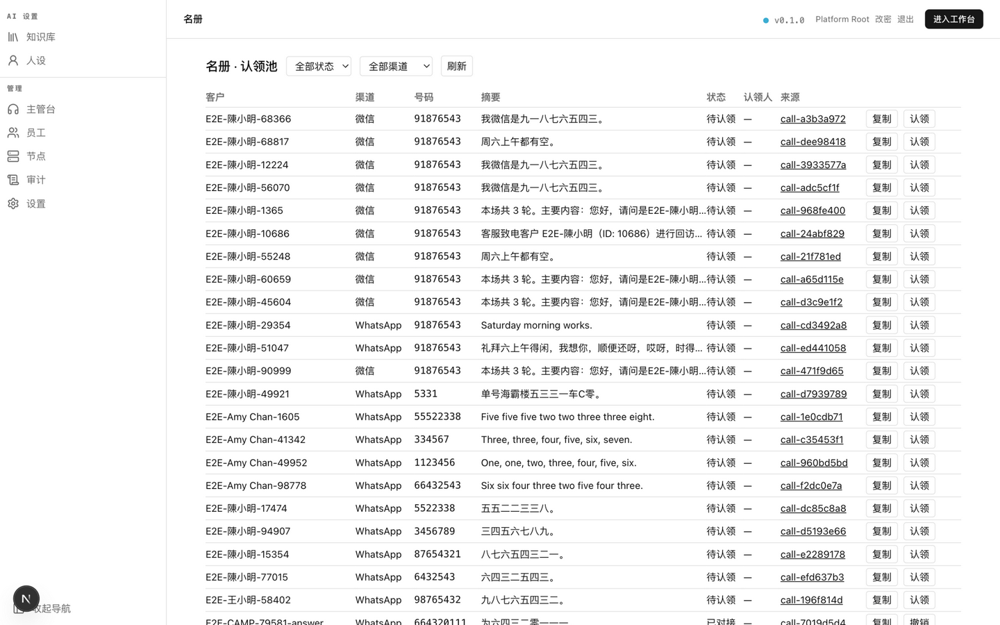

这页干什么：AI 从通话里捕获到的客户联系方式汇聚成池，供人工认领跟进。谁用：话务员（认领）、主管（督办）。

| 控件 | 作用 | 点了发生什么 |
|---|---|---|
| 全部状态 / 全部渠道 | 筛选下拉 | 状态=待认领/已认领/已对接；渠道=WhatsApp/微信 |
| 刷新 | 重拉列表 | 显示最新名册 |
| 复制（行内） | 复制号码 | 写入剪贴板，按钮短暂变「已复制」 |
| 认领（待认领行） | 把条目认领到自己名下 | 状态变「已认领」，认领人显示自己 |
| 标已对接 / 释放（已认领行） | 完成跟进 / 放弃认领 | 「标已对接」→已对接；「释放」→回到待认领 |
| 撤销（已对接行） | 误操作回退 | 状态退回「已认领」 |

列含义：客户=对象名；渠道=微信/WhatsApp；号码=捕获到的号码；摘要=客户原话或通话摘要（截断的悬停可见全文）；来源=产生这条的通话链接（点击进 /calls）。

操作步骤：① 筛「待认领」→ ② 「复制」号码、点「认领」→ ③ 按摘要回听来源通话 → ④ 跟进完点「标已对接」。

常见坑：同一位客户可能因多通通话出现多行，认领处理一行不影响其它行。

### 03 AI 人设（/personas）

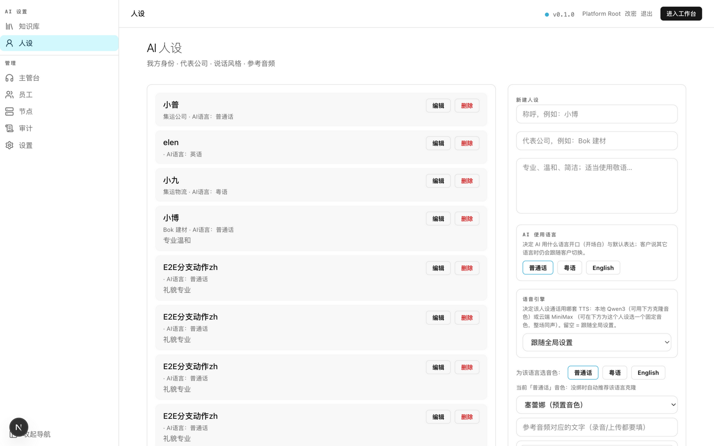

这页干什么：维护「我方是谁」——AI 的称呼、公司、说话风格、发音（音色/参考音频）。谁用：主管。

| 控件 | 作用 | 点了发生什么 |
|---|---|---|
| 编辑 / 删除（每条人设） | 维护人设 | 编辑载入右侧表单；删除弹确认框 |
| 称呼 / 代表公司 / 风格描述 | 人设三要素 | 例：小博 / Bok 建材 / 「专业、温和、简洁；适当使用敬语…」 |
| AI 使用语言（普通话/粤语/English 按钮） | 决定 AI 开场语言与默认表达 | 单选高亮 |
| 语音引擎（下拉） | 本地 Qwen3 或云端 MiniMax/火山 | 选云端=整场固定一把声（不随语言换声），并出现「AI 音色」单选 |
| 为该语言选音色（普/粤/English 页签 + 下拉） | 本地引擎时按语言配声 | 下拉含预置音色与克隆音色 |
| 参考音频对应的文字 | 录音/上传参考音频时必填的文稿 | 配合下方录音/上传控件做音色克隆 |
| 试听 | 试播当前音色 | 合成一段示例语音播放 |

保存人设且音色相关字段有变化时，系统会自动在后台重物化这个人的开场白/垫话/快答罐头录音（跑完才生效，无需手动操作）。

操作步骤：① 新建：右侧填称呼/公司/风格 → ② 选语言与引擎/音色 → ③（可选）录参考音频做克隆 → ④ 保存后到工作台选用该人设。

常见坑：换了人设音色后，已物化的罐头录音要等后台重录完成才会用新声播；「人设若单独绑定音色，优先于设置页全局音色」。

### 04 话术库（/templates，已移出主导航）

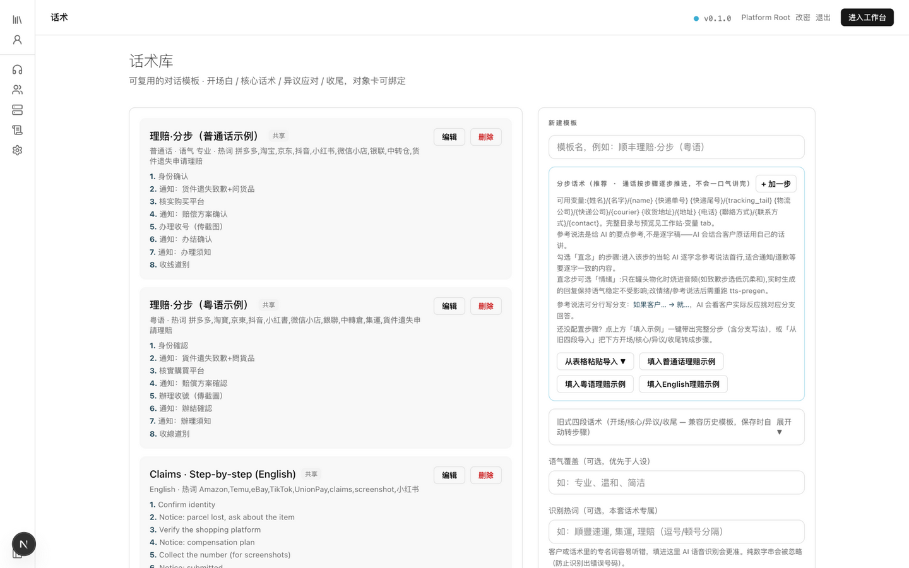

这页干什么：话术模板的老版列表+新建页（共享徽标、分步预览、编辑/删除、示例填入）。**2026-09-20 起内容整合进 AI 工作站，本页已不在左侧导航**——路由保留，可从 AI 工作站或直接输网址进入；日常编辑请用 AI 工作站（见第 3 节）。

| 控件 | 作用 | 点了发生什么 |
|---|---|---|
| 编辑 / 删除（每套话术） | 维护模板 | 编辑载入右侧表单；删除弹确认框 |
| ＋加一步 | 分步话术加一段 | 文本框内追加一节 |
| 从表格粘贴导入 ▾ | 把表格数据一键变成分步话术 | 下拉里还有「填入普通话/粤语/English 话术示例」三个按钮 |
| 旧式四段话术（展开 ▾） | 兼容历史的开场/核心/异议/收尾格式 | 展开后填写，保存时自动转分步 |
| 语气覆盖（可选） | 覆盖人设的语气 | 留空=用人设 |
| 识别热词（可选，本套话术专属） | 提升语音识别对专名的准确率 | 逗号/顿号/分号分隔，数字串会被忽略 |

操作步骤：① 新建：点示例按钮得骨架 → ② 改成自己的分步话术 → ③ 保存后到 AI 工作站继续配意图/发布。

常见坑：在本页改完话术只是草稿——要让新通话按新版讲，必须去 AI 工作站点「发布」。

> 截图与代码差异说明：截图中未见「全部/我的/共享」归属页签——话务员（user）视角才会出现；主管视角直接看全部，与代码一致。

### 06 快答库 · 列表（/qa，已移出主导航）

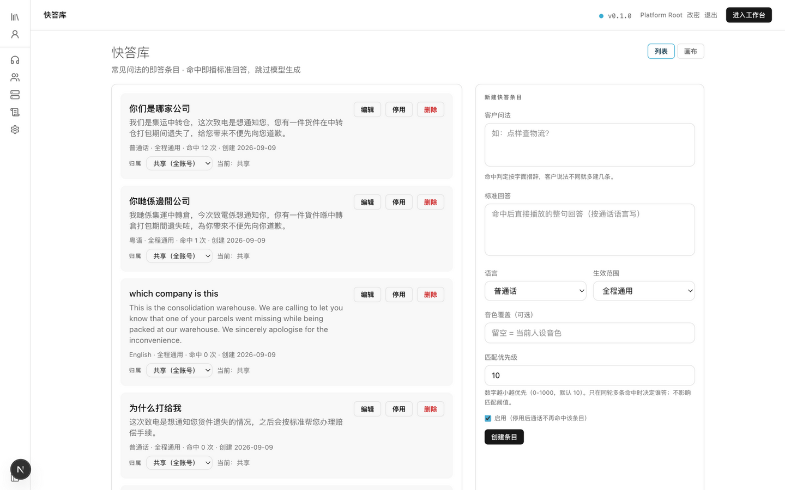

这页干什么：常见问法的「即答条目」——客户问到就直播标准答案录音，跳过模型生成。谁用：话务员（建自己的）、主管（管全部）。与画布同页切换；本页同样已移出主导航，日常入口=AI 工作站「问答库」tab / 问答画布。

| 控件 | 作用 | 点了发生什么 |
|---|---|---|
| 列表 / 画布 | 视图切换 | 见下节（07） |
| 编辑 / 停用 / 删除（每条） | 维护条目 | 停用=通话不再命中（按钮变「启用」）；删除弹确认框 |
| 归属（下拉，主管可见） | 共享（全账号）/ 指派给成员 | 改归属立即保存 |
| 新建快答条目（右侧表单） | 建新条目 | 见下 |

新建表单字段：客户问法（如：点样查物流？；命中按**字面措辞**判定，客户说法不同就多建几条）、标准回答（命中后直接播放的整句回答，按通话语言写）、语言（普通话/粤语/English）、生效范围（全程通用/指定步骤）、音色覆盖（留空=当前人设音色）、匹配优先级（0-1000，默认 10，数字越小越优先，只在同轮多条命中时决定谁）、启用开关 →「创建条目」。

操作步骤：① 把客户最常问的原话写进「客户问法」→ ② 写一句完整「标准回答」→ ③ 创建后找主管补录音（试听有音才算生效）。

常见坑：命中只认字面措辞——客户换个说法就不中，同义问法要多建几条；改了答案文本，旧录音即失效，需重新补录。

### 07 快答库 · 画布

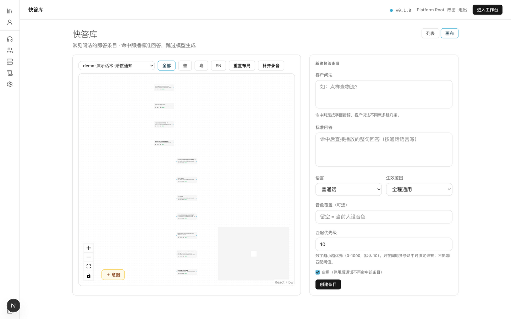

这页干什么：以某套话术为骨架的快答全景图——步骤主线上挂着问答条目、同义簇和意图节点，拖线即配置。谁用：主管为主。

| 控件 | 作用 | 点了发生什么 |
|---|---|---|
| 模板下拉（demo-演示话术-赔偿通知） | 切换骨架话术 | 画布换成该话术的步骤线 |
| 全部 / 普 / 粤 / EN | 语言过滤 | 只显示对应语言条目 |
| 重置布局 | 恢复默认排版 | 清掉手动拖动的节点位置 |
| 补齐录音（仅主管） | 一键给缺录音的条目排队合成 | 提示已排队，稍后自动变「录音✓」 |
| ＋ 意图（琥珀按钮） | 新建意图节点 | 落在视口中心，弹出意图编辑器 |

画布交互：条目节点**右键**=菜单（编辑/启停/删除/试听/重新录音[主管]）；从条目**拖线到步骤**=把条目挂到该步（指定步骤生效）；拖到另一条目=挂成同义簇（轮换播出）；**点意图节点**=开意图编辑器；**右键连线/Delete 键**=解除。意图编辑器字段：名称、触发关键词（逗号分隔，最多 32 个、单个 ≤64 字）、判据（可选，≤400 字：关键词未中时由后台大模型按判据评估模糊说法）、生效步骤（全程/指定步）、绑定动作（**播快答**[可配「播完后跳到」第 N 步] / **跳到某步** / **通知人工**——通知人工无参数，AI 打铃给人工但通话不暂停）、每条绑定的优先级/只执行一次/启用。

操作步骤：① 选模板 → ② 右键条目「重新录音」补缺料 → ③ 「＋意图」建「你们是哪家公司」类意图并绑定播快答 → ④ 保存（整图一次提交，校验不过会红字提示原因）。

常见坑：意图编辑是逐字段重建落库——打开旧意图改个名就保存，未在窗内显示的旧字段会被清掉，改哪项看全窗再确认；话术图数据损坏时页面会黄条警告并锁住编辑（防覆盖），找技术处理。

### 08 外呼战役（/campaigns）

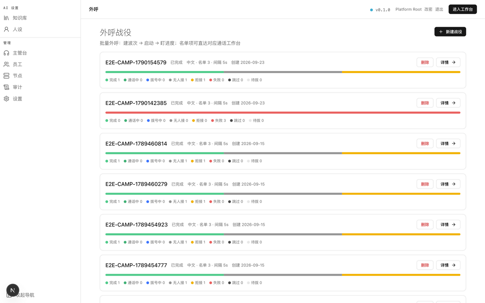

这页干什么：批量外呼——建波次 → 启动 → 盯进度；名单项可直达对应通话工作台。谁用：运营/主管。

| 控件 | 作用 | 点了发生什么 |
|---|---|---|
| ＋ 新建战役 | 三步向导（① 基本 ② 名单 ③ 演练） | 见下 |
| 启动（草稿行） | 开始拨号 | 进入「进行中」，按间隔逐通外呼 |
| 暂停 / 继续（进行中/已暂停行） | 临时停/恢复 | 状态即时切换 |
| 停止（进行中/已暂停行） | 终止战役 | 弹确认框；停止是**终态**，不能再启动 |
| 删除（非进行中行） | 删战役及名单 | 弹确认框；不可恢复 |
| 详情 → | 进详情页 | 进度条+明细表+编辑配置 |

新建向导：① 基本页=战役名称、通话语言（中文/粤语/English）、话术（选定后整波通话用该话术，建单即快照；留空=各自用对象卡绑定的话术）、人设、站点、两通间隔（秒）、外呼时段（按星期勾选+起止时间，最多 3 组，不设=全天可拨）、最大并发（0=不限，默认 1 逐通串行）、自动重拨（未接通按策略回队：最多 N 次/间隔 M 分钟/结果勾选 未接听/拒接/失败）；② 名单页=搜索并勾选对象（对象需先在「对象」页填电话，可「全选当前」）；③ 演练页=被叫句间隔与每对象剧本（正常接听/无人接听/拒接/中途挂断+自定义台词，仅对演练外呼生效）→「创建战役（N 对象）」。

进度条配色（与图例一一对应）：完成=绿 / 通话中=深绿 / 拨号中=蓝 / 无人接=浅灰 / 拒接=橙 / 失败=红 / 跳过=深灰 / 待拨=浅白。详情页还可按状态筛选明细，每行「进入工作台」直达该通通话。

操作步骤：① 新建战役填基本信息 → ② 勾名单 → ③（演练才需）配剧本，创建 → ④ 列表点「启动」→ ⑤ 盯进度条，点「详情」看明细。

常见坑：进行中的战役不能改配置也不能删（先暂停）；「停止」不可逆；外呼时段不支持跨零点。

### 09 同声传译 v1 旧版（/translate，2026-10-02 已随 v1 退役删除，本节作历史留档）

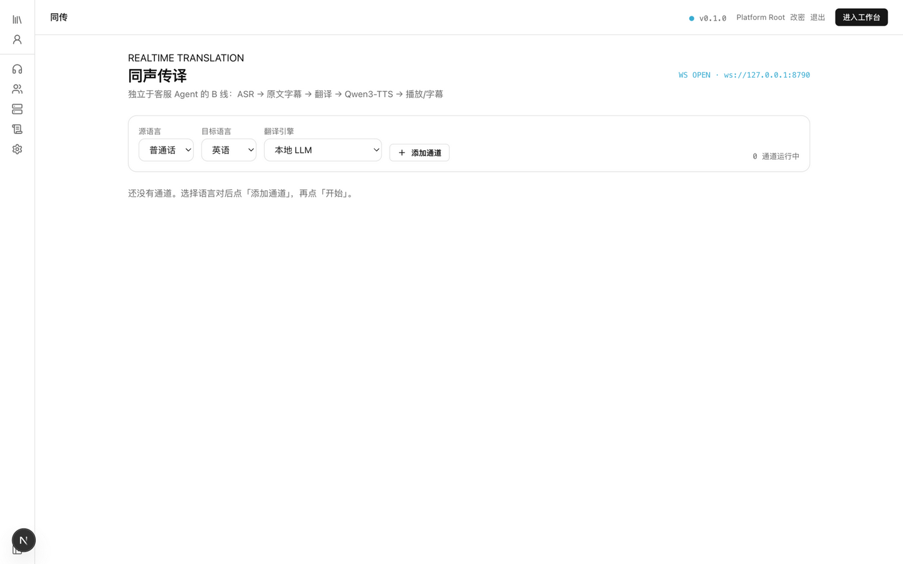

**注意：本页是 v1 旧版界面（早期验证页，功能已冻结、不再演进），页面与 WS :8790 已于 2026-10-02 删除（代码见 git 历史）。现行同传入口是左侧导航「工作台 → 同传」（/interpret 坐席一体台，见附录 4.3）**；本节仅作对照留档。

这页干什么（v1 时期）：独立于客服 Agent 的轻量同传——本机麦克风进、译文字幕+译音出。右上角「WS OPEN · ws://127.0.0.1:8790」是翻译服务连接状态（绿色=正常，红色 CLOSED=服务没起）。

| 控件 | 作用 | 点了发生什么 |
|---|---|---|
| 源语言 / 目标语言（下拉） | 选语言对（普通话/粤语/英语） | 语言对在开通道时钉死 |
| 翻译引擎（下拉） | 本地 LLM 或 DashScope Qwen-MT | 决定走本地还是云端翻译 |
| ＋ 添加通道 | 新建一路翻译 | 下方出现通道卡 |
| 开始 / 停止（通道卡） | 启停采集与翻译 | 开始会请求麦克风权限 |
| 通道卡字幕区 | 原文（灰）+ 译文（青）逐句滚动 | 自动滚出 |
| 指标区（queueDepth/backlog/dropped 等） | 观察积压与丢块 | 技术排障用 |

操作步骤：① 选语言对与引擎 → ② 「添加通道」→ ③ 点「开始」对着麦克风讲话 → ④ 看字幕/听译音，结束点「停止」。

常见坑：本页是 v1 旧版（现行入口 /interpret 一体台）；v1 输出跟随系统默认扬声器、无设备级路由。

### 10 主管台（/supervisor）

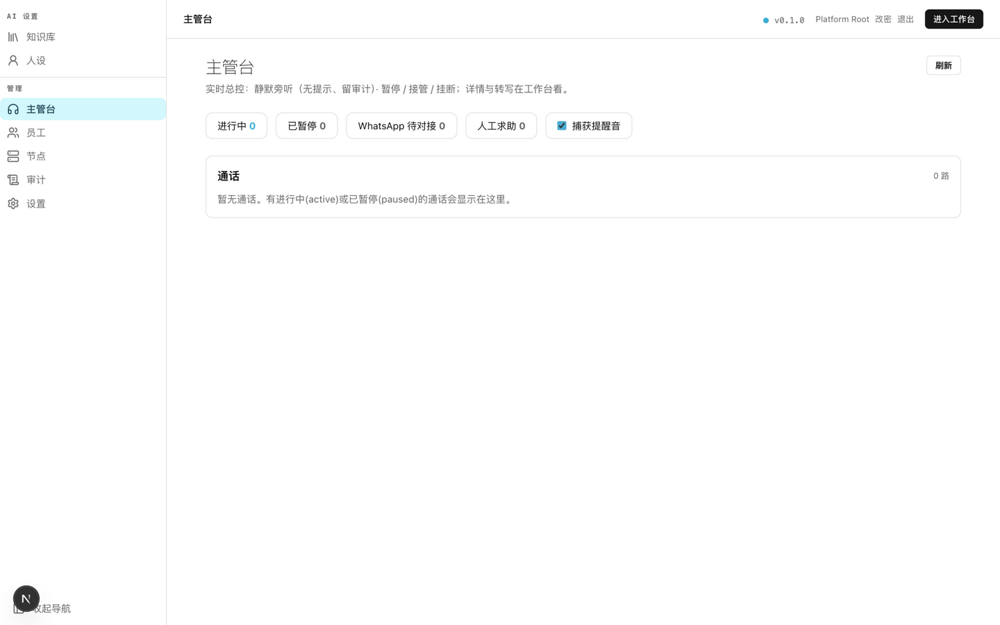

这页干什么：实时总控——静默旁听（无提示、留审计）、暂停/接管/挂断，及 WhatsApp 捕获与人工求助的打铃呈现。谁用：主管。

| 控件 | 作用 | 点了发生什么 |
|---|---|---|
| 刷新 | 立即重拉（平时 4 秒自动刷） | — |
| 进行中 / 已暂停 / WhatsApp 待对接 / 人工求助 | 四个统计芯片 | 数字即当前数量 |
| ☑ 捕获提醒音 | 打铃开关 | 开启后有捕获/求助跳变时蜂鸣+（已授权时）系统通知；首次开启会顺带请求通知授权 |
| （WhatsApp 横幅）复制号码 / 标记已对接 / 进入工作台 | 处理待对接 | 「已拿到号码」时显示大号号码可复制；「标记已对接」收横幅 |
| （人工求助横幅）接管 / 进入工作台 | 处理求助 | 接管弹确认框，确认后 AI 停止自动应答 |
| 静默旁听（每路通话） | 无提示旁听 | 页内展开旁听面板（`/supervisor?listen=<id>` 同效） |
| 暂停 AI / 恢复 AI | 压住/恢复自动应答 | 按钮按状态二选一出现 |
| 接管（人工） | 人工接手 | 弹确认框；AI 永久停嘴，状态转「AI 已暂停」 |
| 转人工 | 结束 AI 通话并断开房间 | 弹确认框 |
| 挂断 | 结束通话 | 弹确认框；触发结算 |

每路通话行显示：对象名+徽标、语言、话术第 N 步、已进行时长、客户最后一句话、状态点（进行中=绿闪 / AI 已暂停=琥珀）。

操作步骤：① 听到铃声看横幅 → ② WhatsApp 待对接：复制号码、电话跟进后点「标记已对接」；③ 人工求助：点「接管」接手 → ④ 需要听现场点「静默旁听」。

常见坑：提醒音依赖一次页面点击「解锁」（浏览器自动播放策略），新开标签页后先随便点一下页面；后台标签页轮询被浏览器节流可能漏铃，名单池兜底。

### 11 设置（/settings）

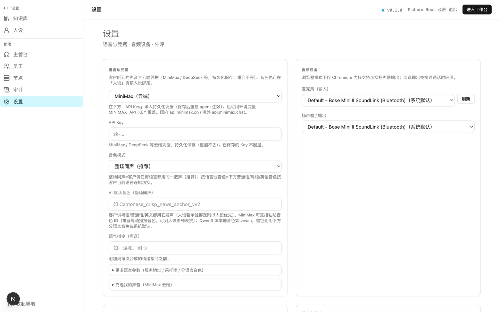

这页干什么：语音供应商与凭据、音频设备、外呼（SIP）等全局配置。谁用：主管（部分敏感项仅 root）。

| 控件 | 作用 | 点了发生什么 |
|---|---|---|
| 语音供应商（下拉） | 选 MiniMax（云端）等 | 决定 TTS 走哪 家 |
| API Key | 云端凭据 | 持久化保存、重启不丢；**已保存的 Key 不回显**（留空=不改） |
| 音色模式（下拉） | 整场同声（推荐）/ 按语言分音色 | 整场同声=客户讲任何语言都同一把声 |
| AI 默认音色 | 填音色 ID 或从人设页选 | 留空=用分语言音色或系统默认 |
| 语气指令（可选） | 附加到每次合成的情绪指令前 | 如「温和、耐心」 |
| ▶ 更多语音参数 | 折叠：服务地址/采样率/分语言音色 | 展开后配置 |
| ▶ 完成我的声音（MiniMax 云端） | 折叠：音色克隆入口 | 展开后录/传参考音频克隆专属音色 |
| 麦克风（输入）＋刷新 / 扬声器（输出） | 音频设备选择 | 仅 Chromium 内核支持切换扬声器；所选输出在接通通话时应用 |
| ▶ 开发者参数（ASR / LLM / VAD / 运行策略） | 页面底部折叠区 | 日常无需动；改动会影响引擎行为 |
| 保存设置 | 提交全部修改 | 成功后部分项需重启 agent 生效 |

操作步骤：① 换 TTS 供应商并填 Key → ② 选音色模式与默认音色 → ③ 「保存设置」→ ④ 按提示重启 agent。

常见坑：API Key 保存后不回显是正常的安全设计；音色也可在「人设」页按人设单独绑定（人设优先）。

### 12 员工管理（/users）

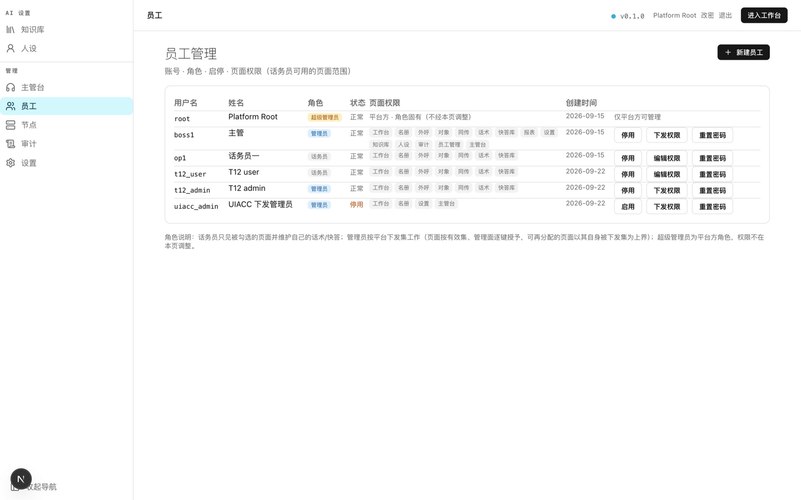

这页干什么：账号 · 角色 · 启停 · 页面权限（话务员可用的页面范围）。谁用：root 全量管理；admin 管理话务员。

| 控件 | 作用 | 点了发生什么 |
|---|---|---|
| ＋ 新建员工 | 建号 | 表单：用户名/姓名/角色（话务员；「管理员」仅 root 可选）/页面权限勾选（工作台/名册/外呼/对象/同传/话术/快答库/报表）——建管理员时 root 还会看到「管理权限下发」六键（设置/知识库/人设/审计/员工管理/主管台） |
| 停用 / 启用 | 账号启停 | 停用弹确认框；停用后该成员无法登录（状态列红字「停用」） |
| 编辑权限（话务员行） | 勾选页面集 | 「收起权限/保存」；保存后立即生效（在线的 token 也即时受控） |
| 下发权限（管理员行，root 视角） | 逐键下发管理面 | 未下发=该 admin 看不到对应管理页 |
| 重置密码 | 改密 | 展开输入新密码保存 |

页面权限列的芯片=该账号可用的页面；角色徽标：超级管理员（橙）/管理员（蓝）/话务员（灰）。root 行固定显示「平台方 · 角色固有（不经本页调整）」与「仅平台方可管理」。页面底部有角色说明：话务员只见被勾选的页面并维护自己的话术/快答；管理员按平台下发集工作（页面按效集、管理面逐键授予，可再分配的页面以其自身被下发集为上界）；超级管理员为平台方角色。

操作步骤：① 「＋新建员工」建话务员 → ② 勾页面权限（报表默认关）→ ③ 员工用分配的账号登录。

常见坑：报表默认不开，需要单独勾；给 admin 下发管理键只能 root 操作；本页改权限即时生效，无需对方重新登录。

### 13 报表（/reports）

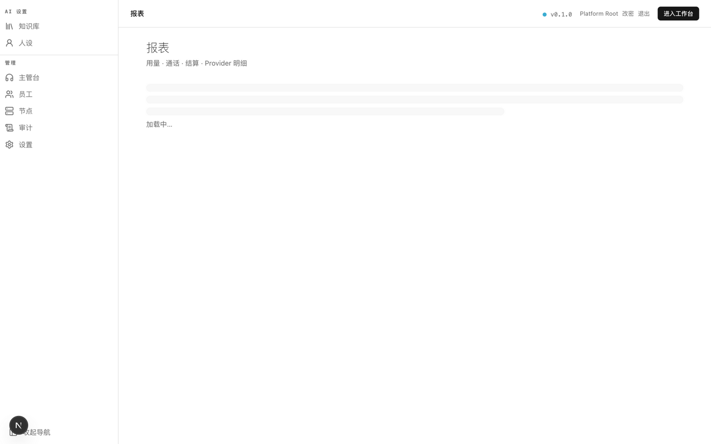

这页干什么：用量 · 通话 · 结算 · Provider 明细。谁用：运营/主管（「报表」页面键默认关闭，需主管授予）。截图拍在加载中（骨架屏+「加载中…」），加载完成后的完整页面：

| 区块 | 内容 |
|---|---|
| 统计四卡 | 通话总数 / 活跃通话 / 已结算 / 总轮次 |
| 通话明细 | 按通话逐行列出（时间、对象、状态、轮次、延迟等，供核对结算） |
| 用量表 | Provider 侧的调用量汇总（云 TTS/LLM 用了多少，成本核对用） |
| 全局洞察卡 | 仅管理面权限可见——跨账号的运营洞察；403 时只隐藏此卡，不影响其余报表 |

操作步骤：① 打开页等骨架屏消失 → ② 先看四卡大盘 → ③ 要对账进明细/用量表；洞察卡看不见=没有管理面权限，找 root。

常见坑：话务员默认无此页；加载慢时先等骨架屏结束，别连点刷新；「报表」权限要在员工管理里逐人勾选。

### 14 审计日志（/audit）

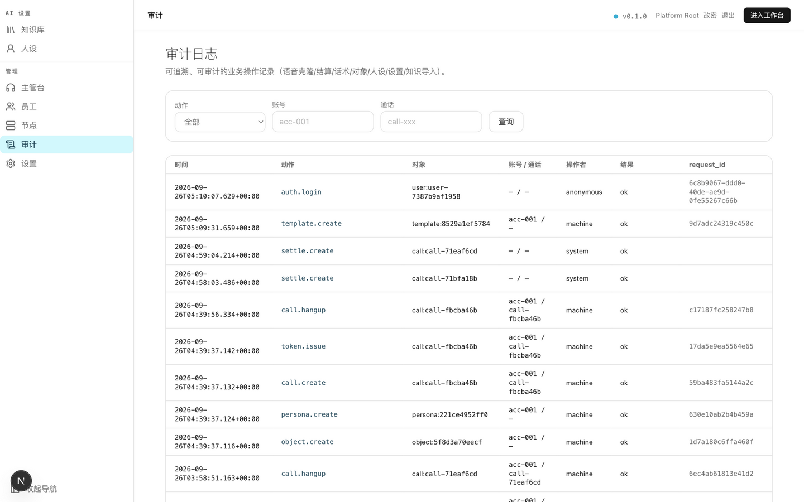

这页干什么：可追溯、可审计的业务操作记录（语音克隆/结算/话术/对象/人设/设置/知识导入等）。谁用：主管（管理键 audit）。

| 控件 | 作用 | 点了发生什么 |
|---|---|---|
| 动作（下拉） | 按动作类型过滤 | 全部 / auth.login / template.create / call.hangup / settle.create 等 |
| 账号 / 通话（输入框） | 按账号（acc-001）或通话 id（call-xxx）过滤 | — |
| 查询 | 执行过滤 | 刷新表格 |

表格列：时间 / 动作 / 对象 / 账号·通话 / 操作者（anonymous=匿名、machine=机器通道（agent worker）、system=系统、具体用户名）/ 结果（ok）/ request_id（排障对账用）。只读页面，无任何写操作。

操作步骤：① 选动作类型或粘贴通话 id → ② 「查询」→ ③ 按 request_id 与技术对账。

常见坑：本页只记业务操作，不含每轮对话细节——对话内容去通话会话页看转写。

### 15 节点管理（/nodes，仅 root）

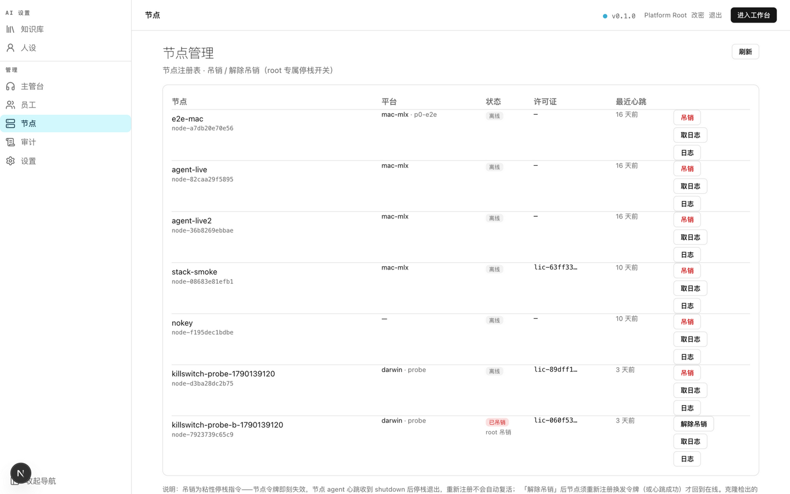

这页干什么：节点注册表 · 吊销 / 解除吊销（root 专属停栈开关）。谁用：仅 root。

| 控件 | 作用 | 点了发生什么 |
|---|---|---|
| 吊销（红字） | 粘性停栈指令 | 弹确认框；该节点令牌即刻失效、节点上的服务停栈退出；**重新注册不会自动复活** |
| 解除吊销（已吊销行） | 恢复前提 | 弹确认框；之后节点须重新注册换发令牌才回到在线 |
| 取日志 | 下传上传指令 | 节点下个心跳周期（≤60 秒）上报日志 |
| 日志 | 展开/收起该节点近期日志 | 含轮转分卷与栈日志 |

列：节点（名称+node-id）/ 平台（如 mac-mlx · p0-e2e）/ 状态（在线/离线/已吊销——「已吊销」红字下注吊销来源，如「root 吊销」）/ 许可证 / 最近心跳。

操作步骤：① 怀疑某节点失控 → ② 「吊销」→ ③ 处理完「解除吊销」→ ④ 节点重新注册上线。

常见坑：吊销是停栈 kill-switch，误吊销会让节点上全部服务退出——确认名称再按；克隆/挪机被自动检出的节点同样出现在这里。

### 16 知识库（/knowledge）

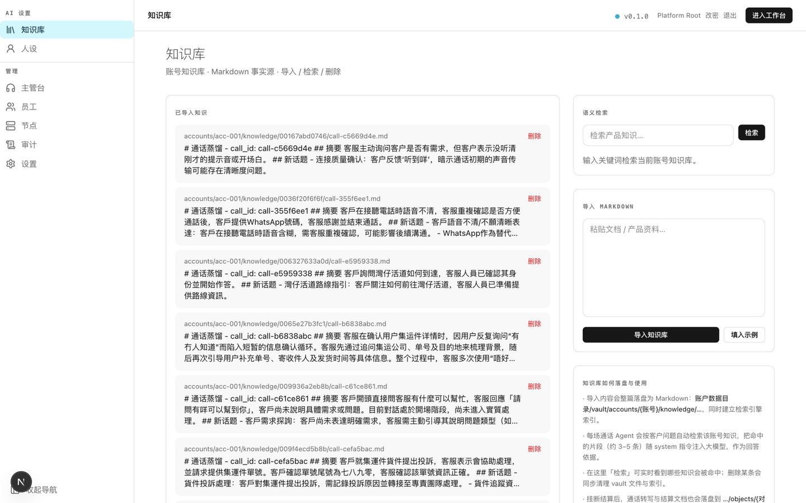

这页干什么：账号知识库——Markdown 事实源的导入 / 检索 / 删除。谁用：主管（管理键 knowledge）。

| 控件 | 作用 | 点了发生什么 |
|---|---|---|
| 已导入知识（左列）+ 删除 | 浏览/删除片段 | 删除弹确认框；同步清理落盘文件与索引；超 50 条时出现「显示全部」 |
| 语义检索 + 检索 | 试查哪些知识会被命中 | 右侧列出命中片段（实时看命中效果） |
| 导入 MARKDOWN + 导入知识库 | 粘贴产品资料入库 | 落盘为 Markdown 并建索引；成功绿字提示 |
| 填入示例 | 一键填入示例文档 | 方便先试一次导入 |

页面底部「知识库如何落盘与使用」说明：导入落盘到账户数据目录 `vault/accounts/{账号}/knowledge/…`；每场通话 Agent 按客户问题自动检索该账号知识，命中片段（约 3–5 条）注入大模型作答；挂断结算后通话转写与结算文档也会落盘到对象目录。

操作步骤：① 「填入示例」→「导入知识库」试一遍 → ② 换成自己的产品资料分篇导入 → ③ 用「检索」验证命中。

常见坑：检索当前为本地字符匹配——导入的措辞要贴近客户问法；删片段不可恢复（文件与索引同删）。

---

## 3. AI 工作站（/studio）——运营主战场专节

### 3.1 列表态

从导航「AI 设置 → AI 工作站」进入，先看到全部话术概览：每行=模板名 + 发布徽标（灰「未发布」/绿「已发布」/琥珀「有未发布改动」）+ 归属徽标（灰「共享」/「我的」/「他人」或成员姓名）+「语言 · N 步 · N 个意图」+「打开 →」。右上「＋ 新建话术」展开新建表单（与话术库同款：模板名/分步话术/示例填入/语气覆盖/识别热词）。点任意行进入工作台态（`/studio/?t=<模板id>`）。

### 3.2 工作台态总览与「应用 / 发布」

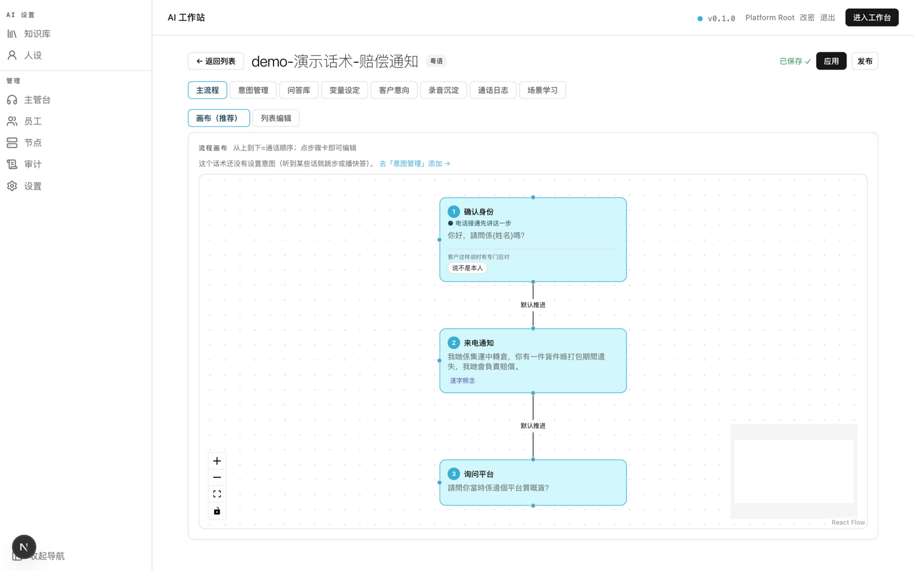

顶栏从左到右：「← 返回列表」→ 模板名 + 语言徽标 → 右侧全局状态：**未保存**（琥珀圆点闪烁，主流程有改动未应用）/ **已保存 ✓** /「应用」按钮（有改动才亮）/「发布」按钮。

- **应用** = 把主流程的修改保存为草稿（唯一保存入口，只写话术步骤）。
- **发布** = 把「已保存」的版本冻结为正式版，**之后拨出的电话都按这个版本讲**；有未应用的修改会先弹窗提醒先「应用」。发布不影响在途通话。

八个页签：主流程 / 意图管理 / 问答库 / 变量设定 / 客户意向 / 录音沉淀 / 通话日志 / 场景学习（「场景学习」仅对有报表权限的人显示）。

常见坑：改完不点「应用」就返回会弹确认（丢修改提醒）；「发布」前确认改动已应用——发布的是已保存版本。

### 3.3 主流程 tab：画布（推荐）/ 列表编辑 双视图

画布（截图默认）：自上而下的步骤卡=通话顺序，连线「默认推进」。每张步卡片显示：步号+目的（如「1 确认身份」）、AI 说的话预览、深色徽标「● 电话接通先讲这一步」（=直念步：进入该步当轮逐字照念，如通知/赔偿承诺）或「逐字照念」标注、以及「客户这样说时有专门应对」分支行（如「说不是本人」）。左侧工具条 +/−/适应/锁定；「这个话术还没有设置意图…去『意图管理』添加 →」是空图提示。

**点任一步卡打开「第 N 步：AI 怎么说」抽屉**（右侧滑出），三件结构化编辑：

- **主要内容**：这步的正稿（进该步首轮后 AI 会结合着讲，不会逐字照念，除非标了直念）。
- **应对**（客户如果这样说 → AI 怎么做，每条一个应对）：条件（客户原话关键词）+ **动作下拉**（按内容回答（默认）/ 礼貌收线=道歉再见后结束通话 / 通知人工=给坐席打铃但 AI 照常应答不打断 / 跳到第 N 步 / 留在本步）+ 应答文本 + 录音状态点 + 「补录」按钮（给这条应对补罐头音频，客户这样说时直接播录音更快更稳）。画布上分支行会按动作显示彩色徽标：收线红 / 转人工蓝 / 跳步琥珀 / 留步紫。
- **给 AI 的补充提醒**：每次都要记住的事实（如必讲的号码）。
- 「＋ 加一条应对」新增分支。抽屉关闭不丢修改——统一走顶栏「应用」保存。

列表编辑视图：按步骤列表批量改文字，底部另有「模板设置」折叠卡（名称/语言/语气/热词，**有独立保存按钮**，不占用「应用」）。两个视图编辑的是同一份草稿，切换不丢。

操作步骤：① 点一步卡 → ② 在抽屉里改正稿/加分支（选动作、写应答）→ ③ 关抽屉 → ④ 顶栏「应用」→ ⑤ 全部改完点「发布」。

常见坑：画布只管「怎么讲」，改完不点「应用」=白改；「发布」才是让新通话生效的那一步。

### 3.4 意图管理 tab

表格+弹窗直编话术意图图：意图=名称+触发关键词（听到即触发，优先级小者先，可限定生效步骤、每通至多一次）+绑定动作（播快答[可加「播完后跳到」第 N 步] / 跳到某步 / 通知人工）+可选判据（关键词未中时后台大模型按判据补判模糊说法）。还提供按话术语言一键导入种子意图包。与问答画布（07）编辑的是同一份图。

操作步骤：① 「＋ 新建意图」→ ② 填名称与触发关键词（按客户原话写）→ ③ 加绑定动作（如播快答+播完跳到第 4 步）→ ④ 保存整图。

常见坑：关键词是字面匹配，客户换个说法不命中——同一意思多写几个关键词；「通知人工」只打铃不打断通话，AI 会继续应答。

### 3.5 问答库 tab

本模板作用域的快答条目表格+弹窗（同 06 页表单：问法/标准回答/语言/生效步骤/音色覆盖/优先级/启用），建完到「录音沉淀」看录音状态。

操作步骤：① 新建条目（问法抄客户原话）→ ② 保存 → ③ 切「录音沉淀」tab 看是否「缺录音」→ ④ 缺则去问答画布右键补录。

常见坑：新条目没录音等于没生效——快答命中后播的是录音，不是文字。

### 3.6 变量设定 tab

占位符目录与预览：列出本话术可用的变量（如 {姓名} {快递单号} {tracking_tail} {聯絡方式}…）、标出无效/写错的占位符告警、并可按对象预览渲染结果。语义与话术引擎同源——这里告警的占位符在通话里就会念出错。

操作步骤：① 打开 tab 对照目录检查话术里的占位符拼写 → ② 选一个真实对象点预览，看替换效果。

常见坑：变量名写错话术里会原样念出「{姓名}」两个汉字——以本 tab 的目录拼写为准。

### 3.7 客户意向 tab

与 /calls 页顶部的「意向规则」折叠卡是同一张卡（账号级规则面）：挂断时按通话事实（时长/轮数/到达步数/是否捕获号码等 12 类）判定意向码/标签/处置，命中即写进通话记录。表格+弹窗编辑，主管可建全局规则。

操作步骤：① 「新建规则」→ ② 加条件（如「已捕获号码 = true」）→ ③ 填意向码与处置 → ④ 保存并保持启用。

常见坑：条件全部成立才判中，别把互斥条件写进同一条；优先级小的先命中，想让某条规则优先生效就给它更小的数字。

### 3.8 录音沉淀 tab

上半是罐头音试听卡（开场白/垫话/快答的物化音频试听）；下半是**挂步骤的问答条目状态面**：每条显示「第 N 步 · 语言」+ 录音徽标（绿「录音✓」/琥珀「缺录音」）。页面提示：补录/重新录音请前往**问答画布**（右键条目「重新录音」）；分支录音在主流程画布的答法抽屉里「补录」。

操作步骤：① 进 tab 扫一遍琥珀「缺录音」→ ② 点页面里的「问答画布」链接 → ③ 右键对应条目「重新录音」。

常见坑：录音是按「答案文本」生成的——改了答案文字，这里的「录音✓」会变回「缺录音」，要重新补录。

### 3.9 通话日志 tab

按本模板过滤的通话列表（最新 50 通）：状态点+状态、语言、处置（意向码）、WhatsApp 徽标、通话 id 与时间；点「查看 →」跳 `/calls?call=<id>` 直接打开那通的工作台。

操作步骤：① 按时间从上往下找目标通话 → ② 「查看 →」回听/看转写。

常见坑：这里只显示挂了本模板的通话——跨模板找通话去 /calls 全量列表。

### 3.10 场景学习 tab（学习闭环驾驶舱）

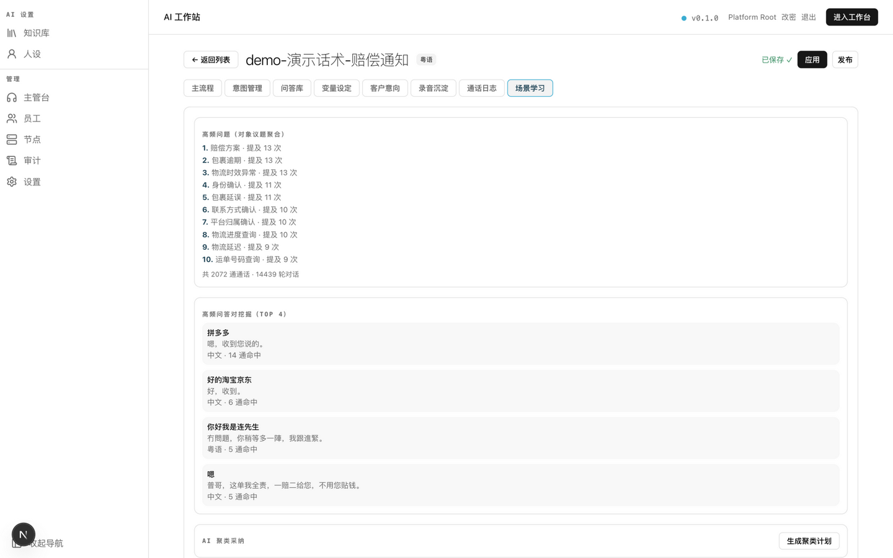

自上而下四块：

1. **话术优化分析（StudyTab 上半）**——「高频问题（对象议题聚合）」TOP10（截图：赔偿方案·提及 13 次…）与「共 N 通对话 · N 轮对话」总口径；接着「高频问答对挖掘（TOP N）」：每条=客户原话→AI 当时的高频答法+「语言 · N 命中」。
2. **AI 聚类采纳（StudyTab 下半）**——点「生成聚类计划」（本地大模型把挖掘候选对着现有词条归类，约十几秒），出三组勾选清单：**变体 → 并入既有词条**（按候选原话入库、继承既有答案）/ **新词条** / **丢弃（只读）**。勾选后点「采纳选中（N）」入库；入库后新词条需补录罐头音才真正生效（问答画布右键重新录音，或主管在设置页触发）。需要问答库权限才能生成/采纳。注意：生成与采纳必须同参数，中途改过条件要「重新生成聚类计划」再采纳。
3. **GapMining：快路覆盖率 + would-hit 汇总条**——「快路覆盖率」看「照稿念的回复占比」大数字 + 三个小卡（脚本/录音直出、AI 现场组织、回复轮合计），占比越高回答越快越稳，可点「按来源细分」看明细。其上的 **would-hit 汇总条**（喂库收益信号）读法：大数字 X% =「漏网问法里已有词条能直接接住的占比」，旁边两卡=漏网问法组数 / 已有词条覆盖数——把漏网问法采集成词条，这个数字就会涨；显示「无漏网」=最近通话没有反复出现的现场组织问法。
4. **漏网轮候选（三段式主体）**——「客户这么说，AI 是现场组织的」清单：每条=客户原话、出现 N 轮 · 涉及 N 通通话 · 话术第 N 步 · 语言、AI 当时说的原句、可回听通话 id。每句话有三种教法（确认后才生效）：
   - **采集为问答词条**（需问答库权限）：弹「确认采集」，答案预填 AI 当时说的话、**可先改再入库**；已采集的显示绿字「✓ 已采集」。
   - **做成话术分支**（需话术权限）：给某一步追加「如果客户…→就…」的应对行，应答可先改再存；已存在等价分支的显示为不可采纳并给原因（不会从画面消失）。
   - **做成意图词**（需话术权限）：给既有意图加触发关键词，同样可先改再存、重复时不可采纳。
   - 采纳提示会说明：改动只进**草稿**——记得去话术页「发布」才会生效。
5. **已入库快速回答的体检**（通知面）——「哪里该改、哪里可以删」：顶部摘要「改答案 N 条、建议删 N 条」；每条提案带人话标题/明细/次数，动作二选一：「删掉这条」（如从未被问过、客户报数字直接被绕过的词条）→「确认删掉」；「改这条答案」（如播了快答客户又问一遍、入库后从未命中）→ 弹窗改答案「确认改答案」。改答案会使旧录音失效：管理员操作会按批自动触发补录音；普通账号会提示需要找管理员补录。

常见坑：本 tab 需要「报表」权限；聚类的 dry 计划有过期时间——生成后放置太久再点采纳会被要求重新生成；体检里「从未命中」可能是词条被更高优先级条目抢了出场，删前看明细两条可能原因。

---

## 4. 附录

### 4.1 全站状态徽标总表

| 徽标/颜色 | 出现位置 | 含义 |
|---|---|---|
| 进行中（绿点） / 振铃（黄点） / 已暂停（蓝点） / 已结束（灰点） / 失败（红点） | 通话列表、通话日志、主管台 | 通话状态 |
| WhatsApp 待对接 / WhatsApp+号码（青底闪烁） | 通话列表、主管台 | 客户应承加号（offered）/ 已捕获号码（captured，显示号码） |
| 已拿到号码 / 客户已应承加 | 主管台横幅 | 同上两态的人话版 |
| 人工求助（琥珀）+ 意向码 | 主管台 | 客户需要人工（AI 照常应答，等坐席接管） |
| 演示档（品红） | 通话列表 | 云端 Realtime 演示档（root 建单，出境计费） |
| 未发布（灰）/ 已发布（绿）/ 有未发布改动（琥珀） | AI 工作站列表 | 话术发布两态+漂移标记 |
| 共享（灰）/ 我的 / 他人 / 成员姓名（蓝） | 话术列表 | 归属 |
| 共享（灰字小徽标） | 快答列表 | 共享条目且你无编辑权 |
| P{N} | 快答列表/画布 | 匹配优先级 ≠10 时显示（小者先） |
| 录音✓（绿）/ 缺录音（琥珀） | 录音沉淀、问答画布 | 罐头音频物化状态 |
| 已停用（琥珀字） | 快答列表 | 条目停用中，通话不再命中 |
| 草稿/进行中/已暂停/已完成/已停止 | 战役列表 | 战役状态（停止=终态） |
| 完成绿/通话中深绿/拨号中蓝/无人接浅灰/拒接橙/失败红/跳过深灰/待拨浅白 | 战役进度条图例 | 名单项八态 |
| 在线/离线/已吊销（红，注「root 吊销」等来源） | 节点管理 | 节点状态 |
| 超级管理员（橙）/管理员（蓝）/话务员（灰） | 员工管理 | 角色 |
| 正常/停用（红字） | 员工管理 | 账号状态 |
| 待机/预连接缓冲/连接中/初始化/聆听中/思考中/说话中/已断开/失败 | 通话工作台 | 会话链路状态 |
| ● v0.1.0（绿点）/「控制面离线」（红字） | 顶栏 | 控制面健康 |
| 录音状态点（分支答法抽屉/画布分支行）：绿点=已有录音 / 灰点=未录 / 琥珀点=含变量，无法预录 | 主流程画布 | 分支罐头录音状态；琥珀点先把应答里的 {占位符} 补全才能录 |

### 4.2 页面-权限速查（谁能看/谁要点什么）

| 页面 | 话务员（user） | 管理员（admin） | root |
|---|---|---|---|
| 工作台首页 / 通话会话 /calls | 页面键「工作台」 | 默认有 | URL 直达（菜单不显示） |
| 同传 /interpret | 页面键「同传」 | 默认有 | 同上 |
| 名册 /roster · 对象 /objects | 对应页面键 | 默认有 | 同上 |
| 外呼 /campaigns | 页面键「外呼」 | 默认有 | 同上 |
| 报表 /reports | **默认关**，主管勾选 | 默认有（可被收回） | 同上 |
| AI 工作站 /studio | 页面键「话术」 | 默认有 | 同上 |
| 话术库 /templates · 快答库 /qa | 对应页面键（深链可达） | 深链可达 | 同上 |
| 知识库 /knowledge · 人设 /personas | 不可见 | root 下发管理键 | 菜单直出 |
| 主管台 /supervisor · 审计 /audit · 设置 /settings | 不可见 | root 下发管理键 | 菜单直出 |
| 员工 /users | 不可见 | root 下发「员工管理」键；管理 admin 行仍仅 root | 菜单直出 |
| 节点 /nodes | 永不可见 | 永不可见 | 专属 |
| 敏感操作（短信发送、SIP 站点、声纹克隆、预览试听、删除通话、节点吊销） | 不可用 | 部分 root 专属（页面按钮不出现即无权） | 可用 |

### 4.3 快捷入口（截图未含的页面与弹窗）

- **工作台首页（/，即登录后落地的首页；真实样貌见截图 01b）**：统计卡（当前并发/今日呼叫/客户接通率/今日接通量/标记总数/最近会话）、沉默谈话、通话时长分布、坐席排行、待办事项（运行中战役）、标记统计（通话结果/WhatsApp）、最近会话，右侧「快捷入口」（新建通话/对象管理）。
- **通话工作台（/calls/new）**：顶栏「进入工作台」黑色按钮直达（截图未含整体页面）。核心面板：模式（真实业务；「演示档（云端 Realtime）」仅 root 可见）、**对象下拉**（可输名称过滤）、人设下拉，左侧对象档案卡（历史沉淀主题等），右侧大按钮「接通」（连房中变「挂断」）——接通前可在「音频设备」卡选麦克风/扬声器；挂断后自动出结算卡，并保留转写回放。深链：`/calls?call=<id>` 打开指定通话；`/calls/new?object=<id>` 预选对象（「再拨」即走此链）。
- **坐席一体台（/interpret，导航「工作台 → 同传」；截图未含）**：配置卡=我方讲/对方讲（普通话/粤语/English）、我方/对方音色（可选，按语言过滤的 MiniMax 目录）、术语表（每条「源词=译文」或纯词条，逗号/分号/换行分隔）→「创建一体台会话」进入双栏字幕控制台（双向原文+译文、启动传译、大字幕浮窗、逐句延迟面板、「听对方原声」开关）。
- **对象管理（/objects，导航「运营 → 对象」；截图未含）**：AI 对话对方档案的建档/编辑/批量导入（粘贴「姓名,快递单号,物流公司,收货地址,电话」CSV）/批量删除/历史主题；字段与话术变量（{姓名}{快递单号}…）一一对应。
- **意向规则折叠卡**：入口在 /calls 页顶部与 AI 工作站「客户意向」tab（已在 01 节说明）。
- **模板设置折叠卡**：入口在 AI 工作站「主流程 → 列表编辑」底部（名称/语言/语气/热词，独立保存）。

### 4.4 「找不到页面」= 没权限

访问无权限的路径会看到卡片：「无权访问此页面，请联系主管开通权限。」+「返回首页」。处理口径：

| 你的角色 | 找谁 |
|---|---|
| 话务员（user） | 找主管：在「员工」页给你勾对应页面键（报表默认关） |
| 管理员（admin） | 管理页缺=找 root 下发对应管理键；节点页=仅 root，永不开放 |
| 看到「员工管理仅主管可用」提示 | 用主管账号登录，或联系平台管理员 |
| 未登录（匿名本地模式） | 单机形态全部页面可见、默认操作 acc-001 账号；要账号体系需开启认证并登录 |

### 4.5 截图文件对照表（自查用）

| 编号 | 文件 | 页面 |
|---|---|---|
| 00 | assets/ui/00-login.png | 登录页 |
| 01 | assets/ui/01-calls.png | 通话会话（root 视角） |
| 01b | assets/ui/01b-calls-user-nav.png | 话务员视角首页（对照 user 导航） |
| 02 | assets/ui/02-roster.png | 名册 · 认领池 |
| 03 | assets/ui/03-personas.png | AI 人设 |
| 04 | assets/ui/04-templates.png | 话术库 |
| 05 | assets/ui/05-studio.png | AI 工作站 · 主流程画布 |
| 05b | assets/ui/05b-studio-study.png | AI 工作站 · 场景学习 |
| 06 | assets/ui/06-qa.png | 快答库 · 列表 |
| 07 | assets/ui/07-qa-canvas.png | 快答库 · 画布 |
| 08 | assets/ui/08-campaigns.png | 外呼战役 |
| 09 | assets/ui/09-translate.png | 同声传译 v1 旧版（现行入口 /interpret） |
| 10 | assets/ui/10-supervisor.png | 主管台 |
| 11 | assets/ui/11-settings.png | 设置 |
| 12 | assets/ui/12-users.png | 员工管理 |
| 13 | assets/ui/13-reports.png | 报表 |
| 14 | assets/ui/14-audit.png | 审计日志 |
| 15 | assets/ui/15-nodes.png | 节点管理 |
| 16 | assets/ui/16-knowledge.png | 知识库 |

---

本手册对应 2026-09 截版界面；界面改版后请同步更新对应小节与 4.5 对照表。截图重拍后保持文件名不变即可，无需改本文引用。
